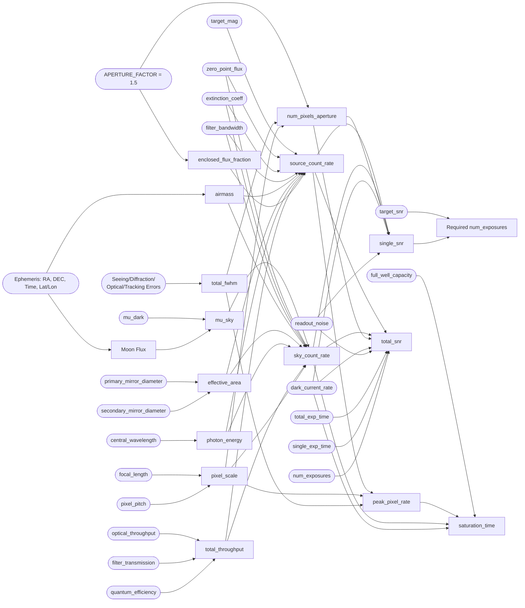
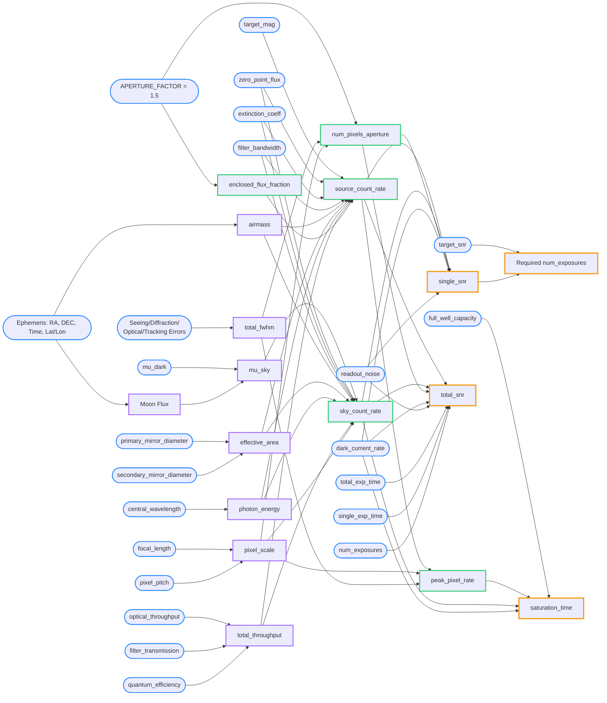

# Algorithm Theoretical Basis Document

## 1. Introduction

### 1.1 Purpose

The primary purpose of this Algorithm Theoretical Basis Document (ATBD) is to delineate the mathematical formulations and logical workflows of the Exposure Time Calculator (ETC) algorithm. The algorithm is designed to compute critical performance metrics for astronomical observations, including the Total Signal-to-Noise Ratio ($SNR_{ESO}$), the required number of exposures ($N_{exp}$), and the sensor saturation time limit ($t_{sat}$).

### 1.2 Scope

The ETC algorithm accounts for a comprehensive set of variables affecting astronomical imaging. It supports the evaluation of both point sources and extended sources. Furthermore, the algorithm incorporates hardware specifications (such as mirror sizes, pixel properties, and sensor noise characteristics) and environmental factors (including atmospheric extinction, moon flux, and total seeing/tracking errors) to ensure accurate simulations of observation conditions.

## 2. Algorithm Architecture Overview

### 2.1 Data Flow

The algorithm architecture follows a strict forward-propagation pipeline, progressing sequentially from external inputs to final observational metrics. The pipeline is divided into four chronological stages:

* **Stage 1: External Input Parameters:** The foundational stage comprising user-defined environmental, hardware, and observational settings.
* **Stage 2: Physical & Environmental Conversions:** Translates external parameters into physical and optical characteristics, such as Airmass ($X$), Effective Area ($A_{\text{eff}}$), and Total FWHM ($FWHM_{\text{total}}$).
* **Stage 3: Photoelectron Count Rates:** Computes the intermediate photoelectron count rates for the target source ($Rate_{\text{src}}$), sky background ($Rate_{\text{sky}}$), and peak pixels ($Rate_{\text{peak}}$) based on the Stage 2 outputs.
* **Stage 4: Final Output Metrics:** Calculates the observational parameters, including the total SNR ($\text{SNR}_{\text{total}}$), single-exposure SNR ($\text{SNR}_{\text{single}}$), required number of exposures ($N_{\text{exp}}$), and saturation limits ($t_{\text{sat}}$).

### 2.2 Processing Flowchart

The dependencies and strict left-to-right progression between these layers are illustrated below. (Note: Node labels reflect the `python_variable_name` alongside the mathematical concepts for cross-reference.)

## 3. Input Parameters Definition (Stage 1)

To ensure seamless integration between the theoretical model and the software implementation, the parameters from the Stage 1 flowchart are strictly organized into four domain pillars. This structure maps directly to the system's `ObservationRequest` schema.

### 3.1 Instrument Profile (`instrument`)

This profile encapsulates all hardware-specific parameters and is subdivided into the telescope, camera, and filter sub-schemas.

#### 3.1.1 Telescope Schema

| Python Field | Math Symbol | Unit | Description |
| --- | --- | --- | --- |
| `primary_mirror_diameter` | $D_{\text{pri}}$ | m | Diameter of the primary optical aperture. |
| `secondary_mirror_diameter` | $D_{\text{sec}}$ | m | Diameter of the secondary mirror (central obscuration). |
| `focal_length` | $f_{\text{sys}}$ | m | Effective focal length of the telescope system. |
| `optical_throughput` | $R_{\text{opt}}$ | dimensionless | Transmission/reflection efficiency of the telescope optics. |

#### 3.1.2 Camera Schema

| Python Field | Math Symbol | Unit | Description |
| --- | --- | --- | --- |
| `pixel_pitch` | $p_{\text{pixel}}$ | µm | Physical size of a single detector pixel. |
| `quantum_efficiency` | $QE$ | dimensionless | Fraction of incident photons converted to electrons. |
| `dark_current_rate` | $R_{\text{dark}}$ | e-/s/pix | Thermal electron generation rate per pixel. |
| `readout_noise` | $\text{RON}$ | e-/pix | Electronic noise introduced during the readout phase. |
| `full_well_capacity` | $\text{FWC}$ | e- | Maximum electron capacity per pixel before saturation. |

#### 3.1.3 Filter Schema

| Python Field | Math Symbol | Unit | Description |
| --- | --- | --- | --- |
| `central_wavelength` | $\lambda_c$ | nm | Central wavelength of the specific filter. |
| `filter_bandwidth` | $\Delta\lambda$ | nm | Effective spectral bandwidth of the chosen filter. |
| `filter_transmission` | $T_{\text{filt}}$ | dimensionless | Transmission efficiency of the inserted filter. |

### 3.2 Target Profile (`target`)

This profile defines the specific astronomical source being observed.

| Python Field | Math Symbol | Unit | Description |
| --- | --- | --- | --- |
| `target_mag` | $m_{\text{target}}$ | mag | Apparent magnitude of the observation target. |
| `zero_point_flux` | $F_{\text{zp}}$ | erg/s/cm²/Å | Reference flux density for a zero-magnitude source. |

### 3.3 Environment Condition (`environment`)

This profile defines the physical environment, geometric constraints, and atmospheric conditions.

| Python Field | Math Symbol | Unit | Description |
| --- | --- | --- | --- |
| `ephemeris` | $\text{Eph}$ | mixed | Geometric data including RA, DEC, Time, Lat, and Lon. |
| `mu_dark` | $\mu_{\text{dark}}$ | mag/arcsec² | Intrinsic surface brightness of the moonless night sky. |
| `extinction_coeff` | $k_{\text{ext}}$ | mag/airmass | Atmospheric attenuation per unit airmass. |
| `fwhm_components` | $FWHM_{\text{comps}}$ | arcsec | Array or object containing spatial spreading errors from Seeing, Diffraction, Optical aberrations, and Tracking. |

### 3.4 Calculation Options (`options`)

This profile holds user-configurable settings that dictate the desired constraints and computation modes.

| Python Field | Math Symbol | Unit | Description |
| --- | --- | --- | --- |
| `aperture_factor` | $k_{\text{ap}}$ | dimensionless | Multiplier defining the photometric aperture radius (default: 1.5). |
| `total_exp_time` | $t_{\text{total}}$ | s | Cumulative integration time across all frames. |
| `single_exp_time` | $t_{\text{single}}$ | s | Integration time for an individual sub-exposure frame. |
| `num_exposures` | $N_{\text{exp}}$ | count | Total number of exposure frames. |
| `target_snr` | $\text{SNR}_{\text{target}}$ | dimensionless | Goal Signal-to-Noise Ratio to solve for time or exposures. |

## 4. Mathematical Formulation and Theoretical Basis

This section details the mathematical models used to process the inputs from Stage 1 into the final performance metrics. The computation follows a strict forward-propagation pipeline through Stages 2, 3, and 4.

### 4.1 Stage 2: Physical and Environmental Conversions

This stage translates raw observational and environmental parameters into physical characteristics and optical efficiencies.

**4.1.1 Observing Geometry and Environment**
The airmass ($X$) is approximated using the secant of the zenith angle ($z$), derived from the target's ephemeris and observer location:

$$X \approx \sec(z) = \frac{1}{\cos(z)}$$

The total sky surface brightness ($\mu_{\text{sky}}$) accounts for both the intrinsic dark sky flux and the contribution from the moon:

$$\mu_{\text{sky}} = -2.5 \log_{10}(Flux_{\text{dark}} + Flux_{\text{moon}})$$

(Note: $Flux_{\text{moon}}$ calculation is deferred to the Krisciunas and Schaefer model.)

**4.1.2 Spatial Resolution**
The total spatial spreading, represented by the Full Width at Half Maximum ($FWHM_{\text{tot}}$), combines contributions from atmospheric seeing, diffraction, optical aberrations, and tracking errors:

$$FWHM_{\text{tot}} = \sqrt{FWHM_{\text{See}} + FWHM_{\text{Dif}} + FWHM_{\text{Opt}} + FWHM_{\text{Trk}}}$$

**4.1.3 Optical System Properties**
The effective collecting area of the telescope ($A_{\text{eff}}$) incorporates the central obscuration from the secondary mirror:

$$A_{\text{eff}} = \frac{\pi}{4} \cdot (D_{\text{pri}}^2 - D_{\text{sec}}^2)$$

The energy of a single photon ($E_p$) at the central wavelength ($\lambda_c$) is determined by Planck's constant ($h$) and the speed of light ($c$):

$$E_p = \frac{h \cdot c}{\lambda_c}$$

The total system throughput ($T_{\text{sys}}$) is the product of the telescope optics, filter transmission, and detector efficiency:

$$T_{\text{sys}} = R_{\text{opt}} \times T_{\text{filt}} \times QE$$

The spatial resolution per pixel, or pixel scale ($S_{\text{pixel}}$), is calculated from the physical pixel pitch and the telescope's focal length:

$$S_{\text{pixel}} = 206265 \cdot \frac{p_{\text{pixel}}}{f_{\text{sys}}}$$

### 4.2 Stage 3: Photoelectron Count Rates

This stage computes the intermediate flux measurements in terms of photoelectron count rates ($e^-/s$) for both the background sky and the target.

**4.2.1 Aperture Definitions**
To define the signal extraction region, we calculate the number of pixels within the photometric aperture ($N_{\text{pix}}$) defined by the aperture factor ($k_{\text{ap}}$):

$$N_{\text{pix}} = \frac{\pi \cdot (k_{\text{ap}} \cdot FWHM_{\text{tot}})^2}{S_{\text{pixel}}^2}$$

The enclosed flux fraction ($f_{\text{enc}}$) within this aperture, assuming a standard Gaussian point spread function (PSF), is:

$$f_{\text{enc}} = 1 - 2^{-4 \cdot (k_{\text{ap}})^2}$$

**4.2.2 Sky and Source Count Rates**
The photoelectron count rate generated by the sky background per pixel ($Rate_{\text{sky}}$) is:

$$Rate_{\text{sky}} = [F_{\text{zp}} \cdot 10^{-0.4 \cdot (\mu_{\text{sky}} + k_{\text{ext}} \cdot X)}] \cdot \Delta\lambda \cdot A_{\text{eff}} \cdot \frac{1}{E_p} \cdot T_{\text{sys}} \cdot S_{\text{pixel}}^2$$

For a point source target, the total detected photoelectron count rate ($Rate_{\text{src}}$) within the aperture is:

$$Rate_{\text{src}} = [F_{\text{zp}} \cdot 10^{-0.4 \cdot (m_{\text{target}} + k_{\text{ext}} \cdot X)}] \cdot \Delta\lambda \cdot A_{\text{eff}} \cdot \frac{1}{E_p} \cdot T_{\text{sys}} \cdot f_{\text{enc}}$$

For analyzing sensor saturation limits on point sources, we isolate the peak flux hitting a single pixel ($Rate_{\text{peak}}$) based on the PSF geometry:

$$Rate_{\text{peak}} = Rate_{\text{src}} \cdot \left( \frac{(2\sqrt{2 \ln 2} \cdot S_{\text{pixel}})^2}{2\pi \cdot FWHM_{\text{tot}}^2} \right)$$

### 4.3 Stage 4: Final Output Metrics

The final stage yields the definitive observational metrics required for telescope planning and scheduling.

**4.3.1 Signal-to-Noise Ratio (SNR)**
The Single Exposure SNR ($\text{SNR}_{\text{single}}$) evaluates the signal quality within a single integration timeframe ($t_{\text{single}}$):

$$\text{SNR}_{\text{single}} = \frac{Rate_{\text{src}} \cdot t_{\text{single}}}{\sqrt{Rate_{\text{src}} \cdot t_{\text{single}} + N_{\text{pix}} \cdot (Rate_{\text{sky}} \cdot t_{\text{single}} + R_{\text{dark}} \cdot t_{\text{single}} + \text{RON}^2)}}$$

The Total SNR ($\text{SNR}_{\text{total}}$) aggregates the signal across the total integration time ($t_{\text{total}}$) and accounts for the accumulation of read noise across multiple exposures ($N_{\text{exp}}$):

$$\text{SNR}_{\text{total}} = \frac{Rate_{\text{src}} \cdot t_{\text{total}}}{\sqrt{Rate_{\text{src}} \cdot t_{\text{total}} + N_{\text{pix}} \cdot Rate_{\text{sky}} \cdot t_{\text{total}} + N_{\text{exp}} \cdot N_{\text{pix}} \cdot (R_{\text{dark}} \cdot t_{\text{single}} + \text{RON}^2)}}$$

**4.3.2 Required Exposures**
If the calculation mode demands solving for time based on a desired signal quality, the required number of exposures is derived as:

$$N_{\text{exp}} = \left( \frac{\text{SNR}_{\text{target}}}{\text{SNR}_{\text{single}}} \right)^2$$

**4.3.3 Saturation Limit**
To ensure the detector operates within its linear regime, the saturation time limit ($t_{\text{sat}}$) evaluates how long it takes for a single pixel to reach its Full Well Capacity (FWC) under the combined flux of the target peak, sky, and dark current:

$$t_{\text{sat}} = \frac{\text{FWC}}{Rate_{\text{peak}} + Rate_{\text{sky}} + R_{\text{dark}}}$$

## 5. Algorithm Limitations & Assumptions

While the Exposure Time Calculator (ETC) is designed to provide robust and efficient performance estimations for observational planning, several physical assumptions and limitations are embedded within the current mathematical model:

### 5.1 Environmental and Geometric Approximations

* **Airmass Approximation:** The airmass ($X$) assumes a plane-parallel atmosphere modeled via the secant approximation ($X \approx \sec(z)$). This approximation holds well for small to medium zenith angles ($z \lesssim 60^\circ$) but degrades at extreme horizons due to atmospheric curvature.

* **Lunar Contribution Exclusion:** The dynamic computation of moon flux relies on the Krisciunas and Schaefer model. Its detailed mathematical formulation is omitted from the core text because it is a standard formula.

### 5.2 Optical and PSF Assumptions

* **Gaussian Point Spread Function (PSF):** The derivation of the enclosed flux fraction ($f_{\text{enc}}$) and peak pixel count rates ($Rate_{\text{peak}}$) assumes an idealized, symmetric Gaussian PSF for point sources. Real-world optical aberrations, tracking errors, or structural diffraction spikes may introduce asymmetry that deviates from this model.

* **Aperture Photometry Constraints:** Signal extraction relies on a fixed aperture multiplier ($k_{\text{ap}} = 1.5$), which assumes optimal circular aperture photometry. Complex crowded fields or extended morphology may require adaptive aperture sizing not covered by this baseline.

### 5.3 Detector and Noise Limitations

* **Linear Regime Operation:** The saturation time limit ($t_{\text{sat}}$) assumes a linear response up to the Full Well Capacity ($\text{FWC}$). Non-linear behaviors or charge transfer inefficiencies near saturation limits are not dynamically modeled.

* **Constant Dark and Readout Noise:** Sensor parameters such as dark current rate ($R_{\text{dark}}$) and readout noise ($\text{RON}$) are treated as constant detector specifications across the entire array, omitting potential spatial variations or thermal fluctuations during long-term observations.

### 5.4 Design Rationale and Model Simplification

While this Exposure Time Calculator references the framework of the ESO ETC 2.0, practical constraints—such as the difficulty of acquiring detailed, high-resolution spectral transmission curves for general-purpose telescopes—lead to a model simplification. Consequently, the algorithm adopts a flux-based estimation approach rather than implementing full spectrophotometric calculations.
