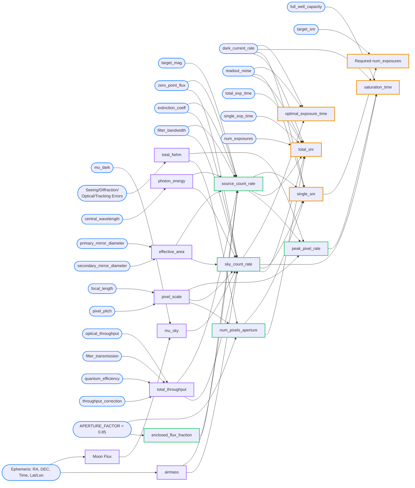

# Algorithm Theoretical Basis Document

## 1. Introduction

### 1.1 Purpose

The primary purpose of this Algorithm Theoretical Basis Document (ATBD) is to delineate the mathematical formulations and logical workflows of the Exposure Time Calculator (ETC) algorithm. The algorithm is designed to compute critical performance metrics for astronomical observations, including the Total Signal-to-Noise Ratio ($SNR_{ESO}$), the required number of exposures ($N_{exp}$), and the sensor saturation time limit ($t_{sat}$).

### 1.2 Scope

The ETC algorithm accounts for a comprehensive set of variables affecting astronomical imaging. It supports the evaluation of both point sources and extended sources. Furthermore, the algorithm incorporates hardware specifications (such as mirror sizes, pixel properties, and sensor noise characteristics) and environmental factors (including atmospheric extinction, moon flux, and total seeing/tracking errors) to ensure accurate simulations of observation conditions.

## 2. Algorithm Architecture Overview

### 2.1 Data Flow

The algorithm architecture follows a strict forward-propagation pipeline, progressing sequentially from external inputs to final observational metrics. The pipeline is divided into four chronological stages:

* **Stage 1: External Input Parameters:** The foundational stage comprising user-defined environmental, hardware, and observational settings.
* **Stage 2: Physical & Environmental Conversions:** Translates external parameters into physical and optical characteristics, such as Airmass ($X$), Effective Area ($A_{\text{eff}}$), and Total FWHM ($FWHM_{\text{total}}$).
* **Stage 3: Photoelectron Count Rates:** Computes the intermediate photoelectron count rates for the target source ($Rate_{\text{src}}$), sky background ($Rate_{\text{sky}}$), and peak pixels ($Rate_{\text{peak}}$) based on the Stage 2 outputs.
* **Stage 4: Final Output Metrics:** Calculates the observational parameters, including the total SNR ($\text{SNR}_{\text{total}}$), single-exposure SNR ($\text{SNR}_{\text{single}}$), required number of exposures ($N_{\text{exp}}$), and saturation limits ($t_{\text{sat}}$).

### 2.2 Processing Flowchart

The dependencies and strict left-to-right progression between these layers are illustrated below. (Note: Node labels reflect the `python_variable_name` alongside the mathematical concepts for cross-reference.)

```mermaid
flowchart LR
    %% ==========================================
    %% Layer 1: External Input Parameters
    %% ==========================================
    
    %% Target & Environment
    Eph([Ephemeris: RA, DEC, Time, Lat/Lon])
    mu_dark([mu_dark])
    FWHM_comps([Seeing/Diffraction/\nOptical/Tracking Errors])
    m([target_mag])
    F0([zero_point_flux])
    k_ext([extinction_coeff])
    dL([filter_bandwidth])
    
    %% Hardware & Optics
    lambda_c([central_wavelength])
    D_pri([primary_mirror_diameter])
    D_sec([secondary_mirror_diameter])
    f_sys([focal_length])
    p_pix([pixel_pitch])
    R_opt([optical_throughput])
    T_filt([filter_transmission])
    QE([quantum_efficiency])
    C_corr([throughput_correction])
    R_dark([dark_current_rate])
    RON([readout_noise])
    FWC([full_well_capacity])
    
    %% Observation Settings
    kap([APERTURE_FACTOR = 0.85])
    t_tot([total_exp_time])
    t_single_in([single_exp_time])
    N_exp_in([num_exposures])
    SNR_tgt([target_snr])

    %% ==========================================
    %% Layer 2: Level III Physical Conversions
    %% ==========================================
    X[airmass]
    Flux_moon[Moon Flux]
    mu_sky[mu_sky]
    FWHM_tot[total_fwhm]
    Ep[photon_energy]
    A_eff[effective_area]
    S_pix[pixel_scale]
    T_sys[total_throughput]

    %% ==========================================
    %% Layer 3: Level II Count Rates
    %% ==========================================
    f_enc[enclosed_flux_fraction]
    N_pix[num_pixels_aperture]
    R_sky[sky_count_rate]
    R_src[source_count_rate]
    R_peak[peak_pixel_rate]

    %% ==========================================
    %% Layer 4: Level I Final Outputs
    %% ==========================================
    SNR_total[total_snr]
    SNR_single[single_snr]
    N_exp_out[Required num_exposures]
    t_sat[saturation_time]
    t_opt[optimal_exposure_time]

    %% ==========================================
    %% Dependencies
    %% ==========================================
    Eph --> X & Flux_moon
    mu_dark & Flux_moon --> mu_sky
    FWHM_comps --> FWHM_tot
    lambda_c --> Ep
    D_pri & D_sec --> A_eff
    f_sys & p_pix --> S_pix
    R_opt & T_filt & QE & C_corr --> T_sys

    kap --> f_enc
    kap & FWHM_tot & S_pix --> N_pix
    
    mu_sky & F0 & k_ext & dL --> R_sky
    X & A_eff & Ep & T_sys & S_pix --> R_sky
    
    m & F0 & k_ext & dL --> R_src
    X & A_eff & Ep & T_sys & f_enc --> R_src
    
    R_src & S_pix & FWHM_tot --> R_peak

    R_src & R_sky & N_pix & R_dark & RON --> SNR_total & SNR_single
    t_tot & t_single_in & N_exp_in --> SNR_total
    
    SNR_tgt & SNR_single --> N_exp_out
    
    FWC & R_peak & R_sky & R_dark --> t_sat
    R_sky & R_dark & RON --> t_opt

    %% ==========================================
    %% Styling Classes
    %% ==========================================
    classDef layer1 stroke:#2b8cff,stroke-width:2px;
    classDef layer2 stroke:#a871ff,stroke-width:2.5px;
    classDef layer3 stroke:#2ecc71,stroke-width:2.5px;
    classDef layer4 stroke:#f39c12,stroke-width:3px;

    class Eph,mu_dark,FWHM_comps,m,F0,k_ext,dL,lambda_c,D_pri,D_sec,f_sys,p_pix,R_opt,T_filt,QE,C_corr,R_dark,RON,FWC,kap,t_tot,t_single_in,N_exp_in,SNR_tgt layer1;
    class X,Flux_moon,mu_sky,FWHM_tot,Ep,A_eff,S_pix,T_sys layer2;
    class f_enc,N_pix,R_sky,R_src,R_peak layer3;
    class SNR_total,SNR_single,N_exp_out,t_sat,t_opt layer4;
```

## 3. Input Parameters Definition (Stage 1)

To ensure seamless integration between the theoretical model and the software implementation, the parameters from the Stage 1 flowchart are strictly organized into four domain pillars. This structure maps directly to the system's `ObservationRequest` schema.

### 3.1 Instrument Profile (`instrument`)

This profile encapsulates all hardware-specific parameters and is subdivided into the telescope, camera, and filter sub-schemas.

#### 3.1.1 Telescope Schema

| Python Field | Math Symbol | Unit | Description |
| --- | --- | --- | --- |
| `primary_mirror_diameter` | $D_{\text{pri}}$ | m | Diameter of the primary optical aperture. |
| `secondary_mirror_diameter` | $D_{\text{sec}}$ | m | Diameter of the secondary mirror (central obscuration). |
| `focal_length` | $f_{\text{sys}}$ | m | Effective focal length of the telescope system. |
| `optical_throughput` | $R_{\text{opt}}$ | dimensionless | Transmission/reflection efficiency of the telescope optics. |

#### 3.1.2 Camera Schema

| Python Field | Math Symbol | Unit | Description |
| --- | --- | --- | --- |
| `pixel_pitch` | $p_{\text{pixel}}$ | µm | Physical size of a single detector pixel. |
| `quantum_efficiency` | $QE$ | dimensionless | Fraction of incident photons converted to electrons. |
| `dark_current_rate` | $R_{\text{dark}}$ | e-/s/pix | Thermal electron generation rate per pixel. |
| `readout_noise` | $\text{RON}$ | e-/pix | Electronic noise introduced during the readout phase. |
| `full_well_capacity` | $\text{FWC}$ | e- | Maximum electron capacity per pixel before saturation. |
| `background_flatness_fraction` | $f_{\text{flat}}$ | dimensionless | Flat-field/background-gradient residual as a fraction of the per-frame background level. Default 0.0 (not modelled). |

#### 3.1.3 Filter Schema

| Python Field | Math Symbol | Unit | Description |
| --- | --- | --- | --- |
| `central_wavelength` | $\lambda_c$ | nm | Central wavelength of the specific filter. |
| `filter_bandwidth` | $\Delta\lambda$ | nm | Effective spectral bandwidth of the chosen filter. |
| `filter_transmission` | $T_{\text{filt}}$ | dimensionless | Transmission efficiency of the inserted filter. |

#### 3.1.4 Instrument-Level Correction

| Python Field | Math Symbol | Unit | Description |
| --- | --- | --- | --- |
| `throughput_correction` | $C_{\text{corr}}$ | dimensionless | Additional system-level throughput correction applied on top of $R_{\text{opt}} \times T_{\text{filt}} \times QE$. Intended for factors not broken out into their own field (e.g. an unresolved instrument-specific efficiency curve); defaults to $1.0$ (no correction). |

### 3.2 Target Profile (`target`)

This profile defines the intrinsic physical properties of the celestial source. To support multiple observation scenarios, the target is decoupled into independent polymorphic objects: spatial coordinates, morphology, SED (Spectral Energy Distribution), and brightness.

| Python Field | Math Symbol | Unit | Description |
| :--- | :--- | :--- | :--- |
| `ra` | $\text{RA}$ | deg | Right Ascension ($0 \le \text{RA} < 360$). |
| `dec` | $\text{DEC}$ | deg | Declination ($-90 \le \text{DEC} \le 90$). |
| `morphology.type` | - | - | Spatial distribution discriminator: `"point"` or `"extended"`. |
| `sed.type` | - | - | Spectral model discriminator: `"flat"` or `"Temp"`. |
| `brightness.type` | - | - | Brightness model discriminator: `"vega_mag"`, `"ab_mag"`, `"jansky_flux"`, or `"wavelength_flux"`. |
| `brightness.target_mag` | $m$ | mag | Apparent magnitude (Required if type is Vega or AB). |
| `brightness.zero_point_flux` | $F_{\text{zp}}$ | erg/s/cm²/Å | Reference flux (Required ONLY if type is `"vega_mag"`). |
| `brightness.flux_value` | $F_\nu, F_\lambda$ | Jy, erg... | Direct physical flux (Required if type is Jansky or Wavelength). |

### 3.3 Environment Condition (`environment`)

This profile defines the physical environment, geometric constraints, and atmospheric conditions.

| Python Field | Math Symbol | Unit | Description |
| --- | --- | --- | --- |
| `location` | $Lat, Lon, Elev$ | deg, m | Strict geographic bounds for observer (Latitude: $\pm 90^\circ$, Longitude: $\pm 180^\circ$). |
| `observing_time_utc` | $t_{\text{obs}}$ | ISO 8601 | Timezone-aware observation timestamp. |
| `auto_calc_background` | - | boolean | Selects the source of $\mu_{\text{sky}}$ (§4.1.1): `true` layers the real-time lunar contribution on top of `mu_dark`; `false` uses `mu_dark` as-is. `mu_dark` is required either way — this flag never derives it. |
| `mu_dark` | $\mu_{\text{dark}}$ | mag/arcsec² | Intrinsic surface brightness of the moonless night sky. Used directly, or as the baseline for `auto_calc_background`. Where `zodiacal_share` accompanies it, this is the *local* component only — airglow and light pollution — with zodiacal light and scattered starlight split back out; where it does not, this is the whole moonless sky, undecomposed. |
| `zodiacal_share` | - | dimensionless, optional | Fraction of the *original, undecomposed* moonless-sky measurement `mu_dark` was split from that was zodiacal light and scattered starlight, at this site's own reference sightline. `None` (the default, and the value for every site without this measurement) means not modelled: `mu_dark` is the whole sky and §4.1.1's $Flux_{\text{zodi}}$ term is zero. |
| `extinction_coeff` | $k_{\text{ext}}$ | mag/airmass | Atmospheric attenuation per unit airmass. |
| `fwhm_components` | $FWHM_{\text{comps}}$ | arcsec | Spatial spreading errors (Seeing, Diffraction, Optical, Tracking). |

### 3.4 Calculation Options (`options`)

This profile holds user-configurable settings that dictate the desired constraints and computation modes.

| Python Field | Math Symbol | Unit | Description |
| --- | --- | --- | --- |
| `aperture_factor` | $k_{\text{ap}}$ | dimensionless | Multiplier defining the photometric aperture radius, in units of $FWHM_{\text{tot}}$. No schema default; callers supply it, and both shipped clients send 0.85 (§5.2). |
| `total_exp_time` | $t_{\text{total}}$ | s | Cumulative integration time across all frames. |
| `single_exp_time` | $t_{\text{single}}$ | s | Integration time for an individual sub-exposure frame. |
| `num_exposures` | $N_{\text{exp}}$ | count | Total number of exposure frames. |
| `target_snr` | $\text{SNR}_{\text{target}}$ | dimensionless | Goal Signal-to-Noise Ratio to solve for time or exposures. |

## 4. Mathematical Formulation and Theoretical Basis

This section details the mathematical models used to process the inputs from Stage 1 into the final performance metrics. The computation follows a strict forward-propagation pipeline through Stages 2, 3, and 4.

### 4.1 Stage 2: Physical and Environmental Conversions

This stage translates raw observational and environmental parameters into physical characteristics and optical efficiencies.

**4.1.1 Observing Geometry and Environment**
The airmass ($X$) is approximated using the secant of the zenith angle ($z$), derived from the target's ephemeris and observer location:

$$X \approx \sec(z) = \frac{1}{\cos(z)}$$

The total sky surface brightness ($\mu_{\text{sky}}$) depends on `auto_calc_background`. When enabled, it accounts for the local dark-sky flux, the real-time contribution from the moon, and — where `zodiacal_share` is supplied — a pointing-dependent zodiacal-light term:

$$\mu_{\text{sky}} = -2.5 \log_{10}(Flux_{\text{dark}} + Flux_{\text{zodi}} + Flux_{\text{moon}})$$

(Note: $Flux_{\text{moon}}$ calculation is deferred to the Krisciunas and Schaefer model.)

$Flux_{\text{zodi}}$ is zero unless `zodiacal_share` is set. Where it is, `zodiacal_share` gives the fraction of the original, undecomposed measurement that was zodiacal light at the site's reference sightline; inverting it against $Flux_{\text{dark}}$ (now the local-only baseline) recovers the zodiacal flux there, and a latitude-dependent shape table (`castor.moon.ZODIACAL_LATITUDE_SHAPE`, derived from ESO SkyCalc — see `validation/QUESTIONS.md` 9 and 10) scales it to the target's actual ecliptic latitude, computed from `ra`/`dec` alone. This is a single averaged shape across bands and one solar elongation only; both are documented simplifications, not zero dependences.

When `auto_calc_background` is disabled, no lunar or zodiacal geometry is evaluated and $\mu_{\text{sky}} = \mu_{\text{dark}}$ directly. $\mu_{\text{dark}}$ is a required input in both cases — moonless-sky brightness (light pollution, airglow, etc.) cannot be derived from time and location alone, so this flag only ever adds terms on top of it, never substitutes for it.

**4.1.2 Spatial Resolution**
The total spatial spreading, represented by the Full Width at Half Maximum ($FWHM_{\text{tot}}$), combines contributions from atmospheric seeing, diffraction, optical aberrations, and tracking errors:

$$FWHM_{\text{tot}} = \sqrt{FWHM_{\text{See}} + FWHM_{\text{Dif}} + FWHM_{\text{Opt}} + FWHM_{\text{Trk}}}$$

**4.1.3 Optical System Properties**
The effective collecting area of the telescope ($A_{\text{eff}}$) incorporates the central obscuration from the secondary mirror:

$$A_{\text{eff}} = \frac{\pi}{4} \cdot (D_{\text{pri}}^2 - D_{\text{sec}}^2)$$

The energy of a single photon ($E_p$) at the central wavelength ($\lambda_c$) is determined by Planck's constant ($h$) and the speed of light ($c$):

$$E_p = \frac{h \cdot c}{\lambda_c}$$

The total system throughput ($T_{\text{sys}}$) is the product of the telescope optics, filter transmission, detector efficiency, and the instrument-level correction factor:

$$T_{\text{sys}} = R_{\text{opt}} \times T_{\text{filt}} \times QE \times C_{\text{corr}}$$

The spatial resolution per pixel, or pixel scale ($S_{\text{pixel}}$), is calculated from the physical pixel pitch and the telescope's focal length:

$$S_{\text{pixel}} = 206265 \cdot \frac{p_{\text{pixel}}}{f_{\text{sys}}}$$

**4.1.4 Target Flux Unification (Top of Atmosphere)**
The engine supports multiple polymorphic brightness inputs. Before calculating the photoelectron count rates in Stage 3, the preprocessing layer unifies the target's brightness into a standard Top-of-Atmosphere (TOA) wavelength flux density ($F_\lambda$) in units of $\text{erg} / \text{s} / \text{cm}^2 / \text{\AA}$. **Crucially, atmospheric extinction is not applied at this stage.**

* **Vega Magnitude System**:
Requires the filter's zero-point flux ($F_{\text{zp}}$).

$$F_\lambda = F_{\text{zp}} \cdot 10^{-0.4 \cdot m_{\text{target}}}$$

* **AB Magnitude System**:
An absolute system defined by a 3631 Jy reference. It is first converted to frequency flux density ($F_\nu$), then translated to $F_\lambda$ using the filter's central wavelength ($\lambda_c$) and the speed of light ($c$).

$$F_\nu = 3631 \cdot 10^{-0.4 \cdot m_{\text{AB}}}$$

$$F_\lambda = F_\nu \cdot \left( \frac{c}{\lambda_c^2} \right)$$

* **Physical Flux Density**:
Inputs provided directly in Jansky (Jy) undergo the wavelength translation above. Inputs already in $F_\lambda$ bypass this conversion completely.

### 4.2 Stage 3: Photoelectron Count Rates

This stage computes the intermediate flux measurements in terms of photoelectron count rates ($e^-/s$) for both the background sky and the target.

**4.2.1 Aperture Definitions**
To define the signal extraction region, we calculate the number of pixels within the photometric aperture ($N_{\text{pix}}$) defined by the aperture factor ($k_{\text{ap}}$):

$$N_{\text{pix}} = \frac{\pi \cdot (k_{\text{ap}} \cdot FWHM_{\text{tot}})^2}{S_{\text{pixel}}^2}$$

The enclosed flux fraction ($f_{\text{enc}}$) within this aperture, assuming a standard Gaussian point spread function (PSF), is:

$$f_{\text{enc}} = 1 - 2^{-4 \cdot (k_{\text{ap}})^2}$$

**4.2.2 Sky and Source Count Rates**
To compute the detected photoelectron count rates, the algorithm first defines a base energy conversion that accounts for atmospheric extinction and system optical throughput. Given a unified TOA flux ($F_\lambda$), the base electron generation rate per unit of spatial distribution is:

$$Rate_{\text{base}} = F_\lambda \cdot 10^{-0.4 \cdot (k_{\text{ext}} \cdot X)} \cdot \Delta\lambda \cdot A_{\text{eff}} \cdot \frac{1}{E_p} \cdot T_{\text{sys}}$$

Depending on the spatial morphology of the source, this base rate is multiplied by a distinct geometric extraction factor:

**A. Point Source Count Rate ($Rate_{\text{src, point}}$)**
For point sources, $F_\lambda$ represents the **total flux** of the star. The geometric factor is the dimensionless enclosed flux fraction ($f_{\text{enc}}$) within the photometric aperture:

$$Rate_{\text{src, point}} = Rate_{\text{base}} \cdot f_{\text{enc}}$$

**B. Extended Source Count Rate ($Rate_{\text{src, ext}}$)**
For extended sources (e.g., galaxies), the input brightness represents a **surface flux density** (flux per $\text{arcsec}^2$). The geometric factor is the total area of the photometric aperture:

$$Rate_{\text{src, ext}} = Rate_{\text{base}} \cdot (N_{\text{pix}} \cdot S_{\text{pixel}}^2)$$

**C. Sky Background Count Rate ($Rate_{\text{sky}}$)**
The sky brightness ($\mu_{\text{sky}}$) is first converted into a surface flux density ($F_{\text{sky}, \lambda}$). Because background noise is evaluated on a per-pixel basis, the geometric factor is the area of a single pixel.

Unlike A and B, the sky does **not** carry the extinction term. $\mu_{\text{sky}}$ descends from $\mu_{\text{dark}}$, a surface brightness measured from the ground and therefore already through the atmosphere; attenuating it by $10^{-0.4 \cdot k_{\text{ext}} X}$ counts the same atmosphere a second time. The geometric factor is applied to the collected rate directly:

$$Rate_{\text{sky}} = F_{\text{sky}, \lambda} \cdot \Delta\lambda \cdot A_{\text{eff}} \cdot \frac{1}{E_p} \cdot T_{\text{sys}} \cdot S_{\text{pixel}}^2$$

Note that A and B both describe light originating outside the atmosphere — a galaxy's surface brightness is as much a top-of-atmosphere quantity as a star's total flux — which is why they share $Rate_{\text{base}}$ and the sky does not.

### 4.3 Stage 4: Final Output Metrics

The final stage yields the definitive observational metrics required for telescope planning and scheduling.

**4.3.1 Signal-to-Noise Ratio (SNR)**

Both SNR expressions below use a single background pixel count,

$$N_{\text{bkg}} = N_{\text{pix}} + N_{\text{est}}$$

where $N_{\text{est}}$ is the cost of *estimating* the sky, defined in 4.3.2. Setting $N_{\text{est}} = 0$ recovers the textbook CCD equation, which is what CASTOR computed until this term was added, and what it still computes when `options.sky_annulus` is omitted.

They also carry a flatness variance term $V_{\text{flat}}$, defined in 4.3.1a. Unlike every other term here it is *not* multiplied by $N_{\text{bkg}}$ — it is not per-pixel photon noise, and enters the total variance once, already summed over the aperture.

The Single Exposure SNR ($\text{SNR}_{\text{single}}$) evaluates the signal quality within a single integration timeframe ($t_{\text{single}}$):

$$\text{SNR}_{\text{single}} = \frac{Rate_{\text{src}} \cdot t_{\text{single}}}{\sqrt{Rate_{\text{src}} \cdot t_{\text{single}} + N_{\text{bkg}} \cdot (Rate_{\text{sky}} \cdot t_{\text{single}} + R_{\text{dark}} \cdot t_{\text{single}} + \text{RON}^2) + V_{\text{flat}}(t_{\text{single}})}}$$

The Total SNR ($\text{SNR}_{\text{total}}$) aggregates the signal across the total integration time ($t_{\text{total}}$) and accounts for the accumulation of read noise across multiple exposures ($N_{\text{exp}}$):

$$\text{SNR}_{\text{total}} = \frac{Rate_{\text{src}} \cdot t_{\text{total}}}{\sqrt{Rate_{\text{src}} \cdot t_{\text{total}} + N_{\text{bkg}} \cdot Rate_{\text{sky}} \cdot t_{\text{total}} + N_{\text{exp}} \cdot N_{\text{bkg}} \cdot (R_{\text{dark}} \cdot t_{\text{single}} + \text{RON}^2) + V_{\text{flat}}(t_{\text{total}})}}$$

$N_{\text{est}}$ appears in both places because each frame is sky-subtracted with its own estimate: stacking averages those estimates down at exactly the rate it averages down everything else. $V_{\text{flat}}$ does not follow that rule — see 4.3.1a for why it is evaluated at $t_{\text{single}}$ in one expression and $t_{\text{total}}$ in the other.

**4.3.1a Background Flatness Variance ($V_{\text{flat}}$)**

Every noise term above is photon counting: independent from pixel to pixel, so it averages down as more pixels or more exposures are added. A real flat field and a real background are not perfectly known, and the residual error they leave behind is *correlated* across the aperture — the same fractional error in every pixel, not a different random one — so it does not average down at all as the aperture widens. Measured against a real galaxy (NGC 3621, SLT r', 2026-09-02 — validation/data/raw/_extended_2026-09-02/RESULT.md), aperture noise fit

$$\sigma^2 = N_{\text{pix}} \cdot (Rate_{\text{sky}} \cdot t + \text{RON}^2) + (f_{\text{flat}} \cdot Rate_{\text{sky}} \cdot t \cdot N_{\text{pix}})^2$$

better than the first term alone, with $f_{\text{flat}} = 2.0\%$ of the per-frame background level. The second term is $V_{\text{flat}}$:

$$V_{\text{flat}}(t) = (f_{\text{flat}} \cdot Rate_{\text{sky}} \cdot t \cdot N_{\text{pix}})^2$$

deliberately built on $N_{\text{pix}}$ alone, not $N_{\text{bkg}}$: the residual is a property of the aperture's own footprint on the flat, not of the separate annulus used to estimate the sky.

Because a single flat field and a single night's background gradient apply identically to every frame of a stack, $f_{\text{flat}}$ does not shrink with more frames the way dark current and readout noise do — the fraction left behind in the final stack is set by the stack's total accumulated background, not by how it was split into exposures. So $V_{\text{flat}}$ is evaluated at $t_{\text{single}}$ in $\text{SNR}_{\text{single}}$ and at $t_{\text{total}}$ in $\text{SNR}_{\text{total}}$, entering once rather than $N_{\text{exp}}$ times.

At 1.5" aperture radius this term was undetectable against the noise floor; at 12" it made the predicted SNR optimistic by a factor of 2 — see §5.3. $f_{\text{flat}} = 0$ (the default) recovers the equations of 4.3.1 exactly as they were before this term existed.

**4.3.2 Cost of the Sky Estimate ($N_{\text{est}}$)**

The sky removed from the aperture is not the true sky but an estimate of it, formed in an annulus of inner and outer radii $k_{\text{in}} \cdot \text{FWHM}_{\text{tot}}$ and $k_{\text{out}} \cdot \text{FWHM}_{\text{tot}}$:

$$N_{\text{ann}} = \frac{\pi \cdot \left( (k_{\text{out}} \cdot \text{FWHM}_{\text{tot}})^2 - (k_{\text{in}} \cdot \text{FWHM}_{\text{tot}})^2 \right)}{S_{\text{pixel}}^2}$$

$$N_{\text{est}} = c \cdot \frac{N_{\text{pix}}^2}{N_{\text{ann}}}, \qquad c = \begin{cases} \pi/2 & \text{median} \\ 1 & \text{mean} \end{cases}$$

The square arises because the estimate's error is not independent from pixel to pixel: one number is subtracted from all $N_{\text{pix}}$ pixels at once, so it enters the aperture sum $N_{\text{pix}}$ times, and its own variance is already $1/N_{\text{ann}}$ of a single pixel's. The constant $c$ is the large-$n$ Gaussian variance of a median relative to that of a mean; pipelines reduce the annulus with a median (usually sigma-clipped) to reject faint neighbours, and pay $\pi/2$ for it.

$N_{\text{est}}$ carries the same per-pixel variance as the aperture, because the annulus measures that same background — which is why it can be added to $N_{\text{pix}}$ rather than entering as a separate term.

Because $N_{\text{est}} \propto N_{\text{pix}}^2$, it is negligible for tight apertures and dominant for wide ones. At $k_{\text{ap}} = 0.85$ with a $3$–$5 \cdot \text{FWHM}$ annulus it adds about 7% to the variance; at $k_{\text{ap}} = 3$ with a $5$–$8 \cdot \text{FWHM}$ annulus it adds about 36%. That second figure is measured, not assumed: see §5.3.

**4.3.3 Required Exposures**
When the calculation solves for time, the required number of exposures inverts the stacked-SNR relation of §4.3.1. If every noise term averaged down between frames this would be the familiar

$$N_{\text{exp}} = \left( \frac{\text{SNR}_{\text{target}}}{\text{SNR}_{\text{single}}} \right)^2$$

but the flatness residual $V_{\text{flat}}$ does not (§4.3.1a): it tracks the *total* accumulated background, so in a stack its variance grows as $N_{\text{exp}}^2$ rather than $N_{\text{exp}}$. Writing the per-frame signal as $a$, the per-frame variance of the averaging terms (source, sky, dark, readout) as $L$, and the per-frame flatness amplitude as $F$ so that $V_{\text{flat}} = (N_{\text{exp}} F)^2$, the stack SNR is

$$\text{SNR}(N_{\text{exp}}) = \frac{N_{\text{exp}} \cdot a}{\sqrt{N_{\text{exp}} \cdot L + N_{\text{exp}}^2 \cdot F^2}}$$

which inverts to

$$N_{\text{exp}} = \frac{\text{SNR}_{\text{target}}^2 \left( 1/\text{SNR}_{\text{single}}^2 - 1/\text{SNR}_{\text{ceil}}^2 \right)}{1 - \left( \text{SNR}_{\text{target}} / \text{SNR}_{\text{ceil}} \right)^2}, \qquad \text{SNR}_{\text{ceil}} = \frac{a}{F} = \frac{Rate_{\text{src}}}{f_{\text{flat}} \cdot Rate_{\text{sky}} \cdot N_{\text{pix}}}$$

$\text{SNR}_{\text{ceil}}$ is the asymptotic ceiling the stack approaches as $N_{\text{exp}} \to \infty$: signal and flatness noise both grow with total integration time, so their ratio is fixed and no exposure count crosses it. When $f_{\text{flat}} = 0$ the ceiling is infinite and the expression collapses to the square-root law above. When $\text{SNR}_{\text{target}} \ge \text{SNR}_{\text{ceil}}$ the denominator is non-positive — the target is unreachable at any exposure count — and CASTOR reports that state (`target_reachable = false`, `required_exposures = null`, and $\text{SNR}_{\text{total}}$ set to the ceiling) instead of returning a frame count that never meets the request.

**4.3.4 Saturation Limit**
To ensure the detector operates within its linear regime, the saturation time limit ($t_{\text{sat}}$) evaluates how long it takes for a single pixel to reach its Full Well Capacity (FWC) under the combined flux of the target peak, sky, and dark current:

$$t_{\text{sat}} = \frac{\text{FWC}}{Rate_{\text{peak}} + Rate_{\text{sky}} + R_{\text{dark}}}$$

**4.3.5 Background-Limited (Optimal) Exposure Time**
$t_{\text{opt}}$ is the single-exposure integration time at which background shot noise (sky + dark current) overtakes the fixed per-frame readout noise, per pixel. Beyond this point, lengthening a single exposure yields rapidly diminishing SNR returns per unit of *total* integration time, so it becomes more efficient to add exposures than to keep extending one. It is derived from a standard-deviation ratio $k$ between the two noise sources:

$$t_{\text{opt}} = \frac{(k \cdot \text{RON})^2}{Rate_{\text{sky}} + R_{\text{dark}}}$$

$k = 1.0$ (the current fixed default) is the literal crossover point, where background shot noise just overtakes readout noise. This default is provisional — it is not yet backed by a specific reference guideline, and $k$ is not currently exposed as a request parameter.

## 5. Algorithm Limitations & Assumptions

While the Exposure Time Calculator (ETC) is designed to provide robust and efficient performance estimations for observational planning, several physical assumptions and limitations are embedded within the current mathematical model:

### 5.1 Environmental and Geometric Approximations

* **Airmass Approximation:** The airmass ($X$) assumes a plane-parallel atmosphere modeled via the secant approximation ($X \approx \sec(z)$). This approximation holds well for small to medium zenith angles ($z \lesssim 60^\circ$) but degrades at extreme horizons due to atmospheric curvature.

* **Lunar Contribution Exclusion:** The dynamic computation of moon flux relies on the Krisciunas and Schaefer model. Its detailed mathematical formulation is omitted from the core text because it is a standard formula.

* **Sky Background Airmass Dependence:** $Rate_{\text{sky}}$ no longer applies the $10^{-0.4 \cdot (k_{\text{ext}} \cdot X)}$ extinction term that target starlight carries (§4.2.2 C). It previously did, which both double-counted an atmosphere already present in the measured $\mu_{\text{dark}}$ and inverted the sign of the real airmass dependence: sky surface brightness *rises* with airmass, since a longer line of sight contains more emitting atmosphere. ESO's FORS2 model puts the sky 17.6% brighter at $X = 1.5$ and 31.8% brighter at $X = 2.0$, and LCO's calculator holds it flat; the previous behaviour lost 6% and 12%. The current treatment is flat — correct in sign to the extent that it no longer moves the wrong way, but it does not yet model the increase. A van Rhijn term over the atmospheric emission components is the remaining work, and belongs with spectral background modelling rather than as another scalar factor. Quantified in `validation/test_eso.py`.

### 5.2 Optical and PSF Assumptions

* **Gaussian Point Spread Function (PSF):** The derivation of the enclosed flux fraction ($f_{\text{enc}}$) and peak pixel count rates ($Rate_{\text{peak}}$) assumes an idealized, symmetric Gaussian PSF for point sources. Real-world optical aberrations, tracking errors, or structural diffraction spikes may introduce asymmetry that deviates from this model.

* **Aperture Photometry Constraints:** Signal extraction uses a single circular aperture of radius $k_{\text{ap}} \cdot FWHM_{\text{tot}}$, with no adaptive sizing, deblending or PSF fitting; crowded fields and extended morphology may need more. The shipped clients default $k_{\text{ap}}$ to 0.85. There is no one correct value: for a Gaussian PSF the SNR-optimal radius is $0.673 \cdot FWHM$ when the sky dominates, and it grows with no fixed limit as the source comes to dominate — once photon noise from the source outweighs the sky, enclosing more area no longer costs SNR (see the ESO comparison below, where the true optimum already exceeds $1.0 \cdot FWHM$). 0.85 is the choice that stays within 5% of the best achievable SNR across both regimes. The previous default of 1.5 enclosed 99.8% of the source but admitted three times the sky area, giving up 36% of the SNR on a background-limited target.

  ESO's FORS2 ETC sits on the same curve rather than on a different one. Their aperture works out at $1.03 \cdot FWHM$ — 94.7% enclosed — which is the source-dominated end of the trade-off above, and it is very nearly optimal for the case they publish: a $V = 20$ point source on a dark Paranal sky, where the star outweighs the sky in the aperture 5:1 and the true optimum is $1.07 \cdot FWHM$. Re-run the same instrument under a full moon, where the sky outweighs the star 13:1, and the optimum falls to $0.70 \cdot FWHM$ and the ordering reverses: 0.85 beats 1.03 by 9%. So the difference between the two is a choice of operating point on one curve, not a difference of convention. 0.85 is the point that stays within 3% of the best available at both ends, which is what a default has to do when the caller's regime is not known in advance; 1.03 is the better choice if the target is known to dominate, and 1.5 is not the better choice anywhere. Held at matched image quality the whole convention is worth 2.5% of the SNR against ESO. Quantified in `validation/test_eso.py`.

  That optimum is a photon limit, not a universal reduction recipe. On the same fifteen LOT/SOPHIA frames used for the end-to-end check, unflagged and unsaturated stars between 30 and $60\ \text{ke}^-$ had 3.33% median frame-to-frame scatter at $k_{\text{ap}} = 0.85$, against 0.93% at 1.5 and 0.97% from a free-width elliptical-Gaussian PSF fit. In the two brighter bins the three figures were 1.27% / 0.65% / 0.72% and 1.56% / 0.41% / 0.58%. All extractors saw the same stars on the same frames, so intrinsic variability would survive all three; the excess confined to 0.85 is extraction sensitivity to local PSF changes. The default therefore remains 0.85 as CASTOR's least-regret *photon-noise* operating point. A simple aperture pipeline without a stable PSF or per-star aperture correction should instead give CASTOR the larger aperture it will actually use (1.5 was stable in this check). Quantified in `validation/test_endtoend.py`.

### 5.3 Detector and Noise Limitations

* **Linear Regime Operation:** The saturation time limit ($t_{\text{sat}}$) assumes a linear response up to the Full Well Capacity ($\text{FWC}$). Non-linear behaviors or charge transfer inefficiencies near saturation limits are not dynamically modeled.

* **Constant Dark and Readout Noise:** Sensor parameters such as dark current rate ($R_{\text{dark}}$) and readout noise ($\text{RON}$) are treated as constant detector specifications across the entire array, omitting potential spatial variations or thermal fluctuations during long-term observations.

* **Photon Noise Only, Partially Closed for Flat-Fielding:** Every other noise term modeled here scales with photon or electron counts; scintillation and PSF instability do not, and they set a floor the model cannot reach. Measured against 314 stars on fifteen LOT/SOPHIA $r'$ frames (2025-11-06), predictions track the observed scatter to within 8% across seven flux bins spanning $2$ to $260\ \text{ke}^-$ (`validation/test_endtoend.py`). An apparent shortfall above $60\ \text{ke}^-$ that grew with brightness — obs/pred as low as 0.22 for the brightest stars — turned out to be a validation artifact, not a gap in this model: those frames' 16-bit readout saturates at $65535\ \text{ADU} \times 0.92\ \text{e}^-/\text{ADU} = 60292\ \text{e}^-$ peak-pixel count, far below the $150000\ \text{e}^-$ Full Well Capacity this preset carries, and stars riding that ceiling were not excluded. Once stars peaking above $50000\ \text{e}^-$ are dropped, the same bins agree with prediction to within 8%, comparable to the fainter ones. Flat-field and background-gradient residual is no longer entirely outside the model: $V_{\text{flat}}$ (§4.3.1a) carries it when `background_flatness_fraction` is set, measured at 2.0% of the background on the one camera it has been checked against (SLT/DU934P). It defaults to 0.0 (not modelled) for every other preset, and the measured value is itself an upper limit from a cloudy night, not a floor a clear one would also hit.

* **Cost of the Sky Estimate:** That same measurement is where $N_{\text{est}}$ (§4.3.2) comes from. Without it the engine ran 13% optimistic at $k_{\text{ap}} = 3$ (observed/predicted 0.868); with it, 1.011. The correction was not fitted — its size follows from the aperture and annulus geometry alone, and the two agree to better than a percent.

### 5.4 Design Rationale and Model Simplification

While this Exposure Time Calculator references the framework of the ESO ETC 2.0, practical constraints—such as the difficulty of acquiring detailed, high-resolution spectral transmission curves for general-purpose telescopes—lead to a model simplification. Consequently, the algorithm adopts a flux-based estimation approach rather than implementing full spectrophotometric calculations.

As a direct consequence, `target.sed` (§3.2) is accepted and validated by the schema but not yet read by the flux-unification step (§4.1.4): every target is currently treated as spectrally flat across the filter bandpass regardless of the selected SED type. This is a placeholder for future spectrophotometric support, not an active part of the current calculation.
