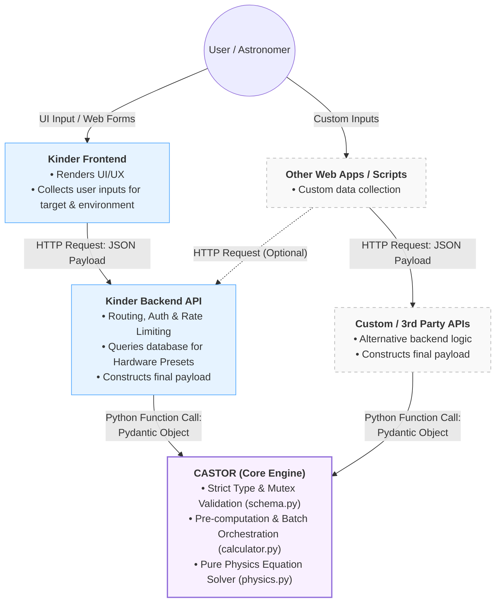

# Architecture

## 1. System Overview

### 1.1 Product Identity

CASTOR is a lightweight, stateless exposure time calculator (ETC) core engine designed specifically for optical astronomical observations. The project completely excludes graphical user interfaces (GUI) and data persistence layers, focusing entirely on implementing underlying physical algorithms—such as optical geometry, atmospheric physics, energy conversion, and signal-to-noise ratio (SNR) calculations—in pure Python. It is engineered to provide precise, high-concurrency computational support for upper-level astronomical web applications.

### 1.2 Core Value

Traditional astronomical exposure time calculators are often tightly coupled with the hardware equipment of specific observatories or exist as monolithic scripts that are difficult to maintain and integrate with modern web services. CASTOR achieves exceptional universality by completely decoupling physical formulas from hardware parameters. Any combination of optical telescopes and sensors can seamlessly invoke this engine for dynamic batch calculations, provided they adhere to the standard data contract.

### 1.3 System Context & Boundary

To maintain the purity and high performance of the core engine, a strict division of responsibilities and a clear data transformation pipeline are established. While CASTOR is natively integrated with the [Kinder](https://kinder.astro.ncu.edu.tw) ecosystem, its decoupled architecture allows it to be invoked by any external application:

#### In Scope for CASTOR

##### A. Core Computational Engine

* **Bidirectional Solvers:** Calculating Signal-to-Noise Ratio (SNR) from a given exposure time, and reverse-calculating required exposure times from a target SNR using an exact analytical quadratic solver.
* **Metric Generation:** Computing total observation time, independent noise contributors (read noise, dark current), electron count rates (source/sky), pixel scale, and sensor saturation flags.

##### B. Data Contract & Batch Orchestration

* **Strict Validation:** Enforcing physical boundaries (e.g., $0.0-1.0$ limits) and logical mutual exclusivity (time vs. SNR) via Pydantic schemas.
* **Polymorphic Time-Domain Expansion:** Ingesting continuous time-range contracts (start, end, step) and automatically expanding them into high-resolution discrete arrays.
* **Vectorized Processing:** Utilizing NumPy for $O(1)$ batch processing of scalar values, discrete arrays, and expanded matrices without Python-level iteration overhead.

##### C. Astronomical & Environmental Modeling

* **Target Morphologies & SEDs:** Supporting both point sources (apparent magnitude) and extended sources (surface brightness), alongside Spectral Energy Distribution (SED) templates for accurate cross-band flux calculations.
* **Dynamic Ephemeris & Background:** Automatically computing instantaneous Airmass, Moon phase, Moon position, and dynamic sky background contributions based on target coordinates and observation timestamps.
* **Atmospheric Corrections:** Applying atmospheric extinction and Point Spread Function (PSF) enclosed-flux modeling.

##### D. Hardware Optics & Sensor Modeling

* **Optical Train Aggregation:** Calculating effective light-gathering area (accounting for obstruction) and total system optical throughput.
* **Dynamic Sensor Configurations:** Adjusting read noise, pixel scale, full-well capacity, and readout overhead dynamically based on user-defined Binning modes (e.g., 1x1, 2x2) and amplifier counts.

##### E. Catalog Resolution (星表解析)

* **External Integration:** Querying external astronomical databases (e.g., SIMBAD) to dynamically resolve celestial target names into precise RA/Dec coordinates and baseline magnitudes.

#### Out of Scope for CASTOR

To maintain its identity as a lightweight, high-performance computational kernel, CASTOR intentionally delegates the following responsibilities to the parent ecosystem (e.g., [Kinder](https://kinder.astro.ncu.edu.tw)):

##### A. Data Persistence & State Management

* **No Hardware Databases:** It does not store default parameter presets for specific observatories, telescopes, or filter zero-points.
* **Stateless Execution:** It does not maintain historical user calculation logs, session states, or user profiles. Every calculation is entirely self-contained.

##### B. Network & Infrastructure

* **No Web Serving:** It does not handle inbound HTTP requests, serve web traffic, or provide API routing (e.g., FastAPI/Flask instances).
* **No Security Middleware:** It does not manage API authentication (OAuth/JWT), authorization, database connection pooling, or rate limiting.

##### C. User Interface & Visualization

* **No Frontend Components:** It does not generate HTML, CSS, JavaScript, or interactive web forms.
* **No Graphical Plotting:** It outputs pure mathematical arrays and scalar metrics; it does not render visibility curves or data plots (e.g., Matplotlib/Plotly figures).

##### D. High-Level Scheduling & Operations

* **No Queue Optimization:** While optimized to *support* schedulers, CASTOR itself does not decide the optimal observation order for targets or generate automated telescope operation queues.
* **No Hardware Constraint Checking:** It does not evaluate telescope mechanical pointing limits (e.g., dome slit collisions or altitude limits) or integrate with real-time weather forecasts.

## 2. Design Principles

## 3. Data Contracts & Schema

The CASTOR project utilizes Pydantic models for strict data validation. The core data structure is designed around the principle of separating "Hardware Configuration" from "Observation Conditions." This ensures type safety and physical unit correctness when passing parameters across different modules.

You can see the complete code definition at [`src/castor/schema.py`](src/castor/schema.py).

### 3.1 Hardware Models

These models define the physical and optical characteristics of the observatory's hardware equipment.

#### `TelescopeSchema`

Defines the core parameters of the light-gathering system.

| Parameter | Type | Default | Description |
| :--- | :--- | :--- | :--- |
| `diameter_m` | `float` (>0) | (Required) | Diameter of the primary mirror in meters (m). |
| `focal_length_m` | `float` (>0) | (Required) | Effective focal length of the telescope in meters (m). |
| `m1_reflectance` | `float` (0~1) | 0.92 | Reflectance of the primary mirror (M1). |
| `m2_reflectance` | `float` (0~1) | 0.92 | Reflectance of the secondary mirror (M2). |
| `glass_transmission` | `float` (0~1) | 0.95 | Transmission rate of any corrective glass or dewar window. |
| `central_obstruction_linear_ratio` | `float` (0~1) | 0.0 | Linear ratio of the central obstruction (secondary / primary mirror diameter). |

#### `CameraSchema`

Defines the geometry, noise characteristics, and readout electronics of the CCD/CMOS sensor.

| Parameter | Type | Default | Description |
| :--- | :--- | :--- | :--- |
| `pixel_size_micron` | `float` (>0) | (Required) | Physical size of a single pixel in microns (μm). |
| `resolution_x/y` | `int` (>0) | (Required) | Number of pixels in the X/Y dimension. |
| `read_noise_e` | `float` (≥0) | (Required) | Readout noise in electrons per pixel (e-/pix). |
| `dark_current_e_per_sec` | `float` (≥0) | 0.1 | Dark current rate in electrons per second per pixel (e-/sec/pix). |
| `quantum_efficiency` | `float` (0~1) | (Required) | Quantum efficiency (QE) of the detector at the observed band. |
| `readout_speed_khz` | `float` (>0) | 100.0 | Sampling rate of the readout electronics (kHz). |
| `n_amplifiers` | `int` (>0) | 1 | Number of amplifiers used during the readout process. |
| `gain` | `float` (>0) | 1.0 | Conversion gain from electrons to ADU (e-/ADU). |
| `full_well_capacity_e` | `float` (>0) | None | (Optional) Maximum electron capacity per pixel before saturation. |

#### `FilterSchema`

Defines the characteristics of the optical filter band.

| Parameter | Type | Default | Description |
| :--- | :--- | :--- | :--- |
| `name` | `str` | (Required) | Name of the filter band (e.g., 'V', 'R', 'I', 'Ha'). |
| `central_wavelength_nm` | `float` (>0) | (Required) | Central wavelength of the filter in nanometers (nm). |
| `fwhm_nm` | `float` (>0) | (Required) | Full Width at Half Maximum (FWHM) of the passband in nanometers (nm). |
| `peak_transmission` | `float` (0~1) | 0.9 | Maximum transmission ratio of the filter. |
| `zero_mag_flux` | `float` | (Required) | Flux of a 0-magnitude star for this band (W m^-2 m^-1). |
| `default_extinction` | `float` | 0.15 | Default atmospheric extinction coefficient (mag/airmass). |

---

### 3.2 Request & Response Contracts

This section defines the interface for the frontend or external systems interacting with the CASTOR calculation core.

#### `ObservationRequest`

This model integrates hardware parameters with specific observation conditions. It implements a `@model_validator` to enforce mutual exclusivity between calculation modes.

> **Core Logic Control:**
> Users must provide *exactly one* of the following: `exposure_time` (to calculate Signal-to-Noise Ratio) OR `target_snr` (to calculate required exposure time). Both fields accept arrays to support batch calculations.

##### A. Hardware & Target Configuration

| Parameter | Type | Default | Description |
| :--- | :--- | :--- | :--- |
| `telescope` | `TelescopeSchema` | (Required) | Complete hardware configuration for the telescope. |
| `camera` | `CameraSchema` | (Required) | Complete hardware configuration for the camera. |
| `instrument_filter` | `FilterSchema` | (Required) | Complete hardware configuration for the filter. |
| `target_mag` | `float` | (Required) | Apparent magnitude of the target celestial object. |

##### B. Environmental Conditions

| Parameter | Type | Default | Description |
| :--- | :--- | :--- | :--- |
| `sky_brightness_mag_arcsec2` | `float` | (Required) | Sky background brightness in magnitude per square arcsecond (mag/arcsec^2). |
| `airmass` | `float` (1.0~5.0) | 1.0 | Airmass of the observation. |
| `seeing_fwhm_arcsec` | `float` (>0) | 1.5 | Atmospheric seeing FWHM in arcseconds. |
| `extinction_coeff` | `Optional[float]` | None | Atmospheric extinction coefficient. If None, uses the filter's default. |

##### C. Control & Advanced Settings

| Parameter | Type | Default | Description |
| :--- | :--- | :--- | :--- |
| `exposure_time` | `Optional[list[float]]` (>0) | None | Exposure time in seconds. Input for SNR calculation. |
| `target_snr` | `Optional[list[float]]` (>0) | None | Requested Signal-to-Noise Ratio. Input for time calculation. |
| `gain_override` | `Optional[float]` (>0) | None | Override the camera's hardware gain for specific scenarios (e.g., CMOS modes). |
| `aperture_radius_arcsec` | `Optional[float]` (>0) | None | Software aperture radius in arcseconds. If None, defaults to 1.5x seeing. |

---

#### `CastorResponse`

Structured output from the CASTOR calculator. Each list item corresponds to the respective input in the request. For array inputs, the returned secondary metrics will be arrays of the corresponding lengths. *(Note: As a response model, fields do not have defaults.)*

| Parameter | Type | Description |
| :--- | :--- | :--- |
| `snr` | `Optional[list[float]]` | The calculated Signal-to-Noise Ratio array. |
| `exposure_time` | `Optional[list[float]]` | The calculated exposure time array. |
| `total_noise_e` | `Optional[list[float]]` | Total noise calculated for each data point in electrons. |
| `is_saturated` | `list[bool]` | True if the signal exceeds Full Well Capacity at each point. |
| `total_observation_time_sec` | `list[float]` | Exposure + Readout time for each calculated point. |
| `source_rate_e_sec` | `float` | Source signal rate. |
| `sky_rate_e_sec_pix` | `float` | Sky background rate per pixel. |
| `pixel_scale` | `float` | Arcsec per pixel. |
| `readout_time_sec` | `float` | Fixed time to read the CCD. |
| `warnings` | `list[str]` | List of warning messages generated during calculation. |

## Component Architecture

## Data Flow

## Future Extensibility
