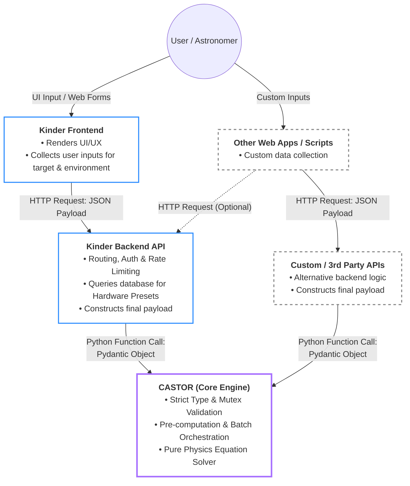
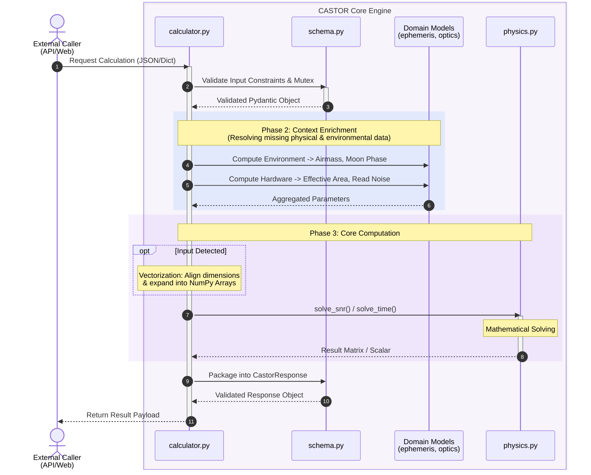
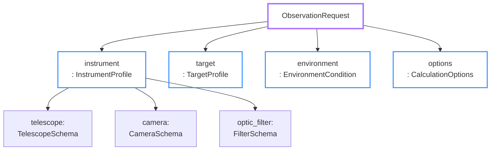

# Architecture

## 1. System Overview

### 1.1 Product Identity

CASTOR is a lightweight, stateless exposure time calculator (ETC) core engine designed specifically for optical astronomical observations. The project completely excludes graphical user interfaces (GUI) and data persistence layers, focusing entirely on implementing underlying physical algorithms—such as optical geometry, atmospheric physics, energy conversion, and signal-to-noise ratio (SNR) calculations—in pure Python. It is engineered to provide precise, high-concurrency computational support for upper-level astronomical web applications.

### 1.2 Core Value

Traditional astronomical exposure time calculators are often tightly coupled with the hardware equipment of specific observatories or exist as monolithic scripts that are difficult to maintain and integrate with modern web services. CASTOR achieves exceptional universality by completely decoupling physical formulas from hardware parameters. Any combination of optical telescopes and sensors can seamlessly invoke this engine for dynamic batch calculations, provided they adhere to the standard data contract.

### 1.3 System Context & Boundary

To maintain the purity and high performance of the core engine, a strict division of responsibilities and a clear data transformation pipeline are established. While CASTOR is natively integrated with the [Kinder](https://kinder.astro.ncu.edu.tw) ecosystem, its decoupled architecture allows it to be invoked by any external application:



#### In Scope for CASTOR

##### A. Core Computational Engine

* **Bidirectional Solvers:** Calculating Signal-to-Noise Ratio (SNR) from a given exposure time, and reverse-calculating required exposure times from a target SNR using an exact analytical quadratic solver.
* **Metric Generation:** Computing total observation time, independent noise contributors (read noise, dark current), electron count rates (source/sky), pixel scale, and sensor saturation flags.

##### B. Data Contract & Batch Orchestration

* **Strict Validation:** Enforcing physical boundaries (e.g., $0.0-1.0$ limits) and logical mutual exclusivity (time vs. SNR) via Pydantic schemas.
* **Polymorphic Time-Domain Expansion:** Ingesting continuous time-range contracts (start, end, step) and automatically expanding them into high-resolution discrete arrays.
* **Vectorized Processing:** Utilizing NumPy for $O(1)$ batch processing of scalar values, discrete arrays, and expanded matrices without Python-level iteration overhead.

##### C. Astronomical & Environmental Modeling

* **Target Morphologies & SEDs:** Supporting both point sources (apparent magnitude) and extended sources (surface brightness), alongside Spectral Energy Distribution (SED) templates for accurate cross-band flux calculations.
* **Dynamic Ephemeris & Background:** Automatically computing instantaneous Airmass, Moon phase, Moon position, and dynamic sky background contributions based on target coordinates and observation timestamps.
* **Atmospheric Corrections:** Applying atmospheric extinction and Point Spread Function (PSF) enclosed-flux modeling.

##### D. Hardware Optics & Sensor Modeling

* **Optical Train Aggregation:** Calculating effective light-gathering area (accounting for obstruction) and total system optical throughput.
* **Dynamic Sensor Configurations:** Adjusting read noise, pixel scale, full-well capacity, and readout overhead dynamically based on user-defined Binning modes (e.g., 1x1, 2x2) and amplifier counts.

#### Out of Scope for CASTOR

To maintain its identity as a lightweight, high-performance computational kernel, CASTOR intentionally delegates the following responsibilities to the parent ecosystem (e.g., [Kinder](https://kinder.astro.ncu.edu.tw)):

##### A. Data Persistence & State Management

* **No Hardware Databases:** It does not store default parameter presets for specific observatories, telescopes, or filter zero-points.
* **Stateless Execution:** It does not maintain historical user calculation logs, session states, or user profiles. Every calculation is entirely self-contained.

##### B. Network & Infrastructure

* **No Web Serving:** It does not handle inbound HTTP requests, serve web traffic, or provide API routing (e.g., FastAPI/Flask instances).
* **No Security Middleware:** It does not manage API authentication (OAuth/JWT), authorization, database connection pooling, or rate limiting.

##### C. User Interface & Visualization

* **No Frontend Components:** It does not generate HTML, CSS, JavaScript, or interactive web forms.
* **No Graphical Plotting:** It outputs pure mathematical arrays and scalar metrics; it does not render visibility curves or data plots (e.g., Matplotlib/Plotly figures).

##### D. High-Level Scheduling & Operations

* **No Queue Optimization:** While optimized to *support* schedulers, CASTOR itself does not decide the optimal observation order for targets or generate automated telescope operation queues.
* **No Hardware Constraint Checking:** It does not evaluate telescope mechanical pointing limits (e.g., dome slit collisions or altitude limits) or integrate with real-time weather forecasts.

## 2. Component Architecture

> **[TBD / Draft Phase]**
> *The internal module division is currently in the draft phase and may evolve after further team discussion.*

The CASTOR package is divided into the following core modules:

```text
src/castor/
├── __init__.py        # Package Entry Point
├── calculator.py      # Main Orchestrator & Batch Processing
├── schema.py          # Data Contracts & Mutex Validation
├── ephemeris.py       # Astrometry, Time & Environment Modeling
├── optics.py          # Hardware & Optical Train Modeling
├── physics.py         # Pure Mathematical & Physics Engine
└── exceptions.py      # Custom Domain Exceptions
```

### Module Responsibilities

* **`calculator.py`:** The system's traffic controller. It receives validated requests, gathers missing parameters from domain modules (`ephemeris`, `optics`), feeds the aggregated NumPy arrays into `physics.py`, and packages the final response.

* **`schema.py`:** Defines Pydantic models to block invalid data at the door. It enforces physical boundaries (e.g., transmission rates strictly between $0.0$ and $1.0$) and logical mutual exclusivity (e.g., requiring either exposure time or target SNR, but not both).

* **`ephemeris.py`:** Handles dynamic variables related to time and space using pure local mathematics (no external API calls). It calculates instantaneous Airmass, Moon phase, and sky background based on observation timestamps and coordinates.

* **`optics.py`:** Converts hardware specifications into physical parameters. It calculates the effective light-gathering area (accounting for obstruction), total optical throughput, and dynamically adjusts pixel scale and read noise based on sensor binning modes.

* **`physics.py`:** The lowest-level computational core. It contains no web schemas or API logic. It accepts only pure numerical matrices or scalars to execute deterministic algorithms—such as analytical quadratic solvers—in strict $O(1)$ complexity.

* **`exceptions.py`:** Centralizes CASTOR-specific error classes (e.g., `TargetNotFoundError`, `PhysicsBoundaryError`) to provide clear, actionable error traces for the parent system.

## 3. Design Principles

### 3.1 Separation of Concerns

CASTOR strictly isolates physical phenomena from software execution logic. The architecture is built around four distinct domain pillars: Instrument, Target, Environment, and Strategy. By decoupling static hardware definitions from dynamic atmospheric conditions and human-driven observation strategies, the core engine remains purely mathematical. Furthermore, internal modules are strictly segregated: `schema.py` handles I/O and validation, domain modules (`optics.py`, `ephemeris.py`) handle context enrichment, and `physics.py` is dedicated exclusively to mathematical solving.

### 3.2 Contract-Driven & Fail-Fast

The system treats the calculation boundary as a strict contract. Utilizing Pydantic models, CASTOR validates all incoming requests at the very edge of the application (Phase 1: Ingress). It enforces both physical boundaries (e.g., optical transmissions must be between $0.0$ and $1.0$) and logical mutual exclusivity (e.g., requesting both `exposure_time` and `target_snr` simultaneously is forbidden). If a contract is violated, the system immediately rejects the request with a precise error trace, ensuring that the underlying physics engine never executes on invalid or unphysical data.

### 3.3 Statelessness

CASTOR is designed as a pure computational kernel. It does not maintain user sessions, historical calculation logs, or hardware databases. Every `ObservationRequest` must be entirely self-contained, carrying all necessary configurations and parameters required for the calculation. This pure $f(\text{input}) = \text{output}$ design ensures that the engine is highly thread-safe, trivially cacheable, and easily scalable for high-concurrency batch processing when invoked by upper-level web APIs.

### 3.4 Analytical Determinism

To guarantee high performance and exact reproducibility, CASTOR avoids iterative approximations or randomized simulations whenever possible. The core computational layer (`physics.py`) relies on exact analytical solvers—such as deterministic quadratic equations to resolve required exposure times from target SNRs. For any identical set of validated inputs, the engine will consistently yield the exact same mathematical outputs in strict $O(1)$ time complexity per data point, making it highly reliable for automated telescope scheduling systems.

## 4. Data Flow & Lifecycle

CASTOR processes each calculation request through a straightforward, step-by-step pipeline. When a request arrives, the engine first validates the input data to catch physical errors or conflicting settings immediately. It then aggregates any missing observation conditions, target coordinates, or hardware specifications using its internal modules. Finally, these completed parameters are passed to the core physics engine to compute the required exposure time or signal-to-noise ratio (SNR), and the final metrics are formatted and returned as the response.



### 4.1 Lifecycle Phases Breakdown

#### Phase 1: Ingress & Validation

* **Input**: A JSON payload or Python dictionary containing the user's observation parameters and hardware configurations.
* **Action**: The `schema.py` module uses Pydantic to strictly validate the incoming data against two main constraints:
  1. **Physical Limits**: Ensures values conform to real-world physics (e.g., exposure times must be positive, and optical transmission rates must fall strictly between 0.0 and 1.0).
  2. **Mutual Exclusivity**: Enforces the core logic requiring the caller to provide either `exposure_time` or `target_snr`, but never both.
* **Output**: A validated Pydantic object (`ObservationRequest`). If any check fails, the system immediately rejects the request with a validation error to protect the core engine.

#### Phase 2: Context Enrichment

* **Input**: The validated `ObservationRequest` object.
* **Action**: Action: Determines if the incoming input has missing data or requires complementation by other functions. It then invokes the corresponding internal functions to calculate and fill in these gaps.
* **Output**: A complete, aggregated set of parameters ready for the mathematical formulas.

#### Phase 3: Core Computation

* **Input**: The enriched and aggregated parameter set.
* **Action**:
  1. **Optional Vectorization**: If the request contains arrays or continuous time ranges, the engine automatically aligns these dimensions and expands them into NumPy arrays to process the entire batch simultaneously without using slow Python loops.
  2. **Mathematical Solving**: The `physics.py` module takes these raw numbers or matrices and runs the core analytical formulas via `some_function()` or `some_function()`. This layer handles pure mathematics and contains no network or database dependencies.
* **Output**: Raw numerical results (scalars or matrices) representing the calculated SNR or exposure times.

#### Phase 4: Egress

* **Input**: The raw numerical outputs from the physics engine.
* **Action**: The orchestrator maps the raw numbers into the final structured output layout. During this step, it also performs hardware boundary checks, such as verifying if the signal level exceeds the sensor's full-well capacity to flag pixel saturation (`is_saturated`).
* **Output**: A validated `CastorResponse` object, which is returned safely to the external client.

## 5. Data Contracts & Schema

The CASTOR project utilizes Pydantic models for strict data validation. For the exhaustive list of parameters, data types, physical units, and validation boundaries, please refer to the [API Documentation](docs/api_spec.md). You can see the complete code definition at [`src/castor/schema.py`](src/castor/schema.py).

### 5.1 Request Schema

To ensure maintainability and preserve the purity of the underlying physics calculations, the CASTOR engine structures its incoming data payload (`ObservationRequest`) using a Domain-Driven Design approach. Rather than flattening all parameters into a single monolithic object, the request is strictly segregated into four independent pillars.

This modularity fully decouples the physical realities of the observatory from the software-level execution logic, allowing the core physics solver to maintain stateless, high-performance execution.

* **Instrument Profile (`instrument`)**: Defines the static hardware components responsible for capturing light. To maximize reusability, it is further subdivided into the telescope's optical system, the camera's sensor electronics, and the passband filter. Notably, the filter schema is designated as `optic_filter` to prevent shadowing Python's built-in `filter` function.
* **Target Profile (`target`)**: Isolates the intrinsic physical properties of the celestial source, such as its magnitude and morphology, completely independent of the observer's location or equipment.
* **Environment Condition (`environment`)**: Captures the dynamic atmospheric and situational context (e.g., seeing, coordinates, and timestamps) that dictates how the target's light is altered before reaching the telescope.
* **Calculation Options (`options`)**: Acts as the software control interface. It separates human-driven observation strategies and runtime overrides—such as toggling between target SNR and exposure time calculations—from the objective physical parameters.



### 5.2 Response Schema

Similar to the request structure, the `CastorResponse` model is designed to be highly deterministic and easily consumable by the parent system or external APIs.

The response strictly avoids UI-specific formatting, presentation layers, or plotting objects, focusing purely on returning raw mathematical value and physical metrics. The output is logically grouped into the following categories:

* **Core Solved Metrics**: The primary objective of the calculation, returning either the computed exposure time or the SNR, strictly depending on the mutually exclusive input strategy.
* **Secondary Diagnostics**: Intermediate physical values computed during calculation, such as total noise electrons, source signal rate, and sky background rate per pixel. Exposing these allows the calling client to render detailed breakdown charts if required.
* **System Metadata**: Standardized fields encompassing domain-specific warning messages and operational metrics like total observation time (including readout overhead).

## 6. Future Extensibility

Vectorized Batch Optimization
