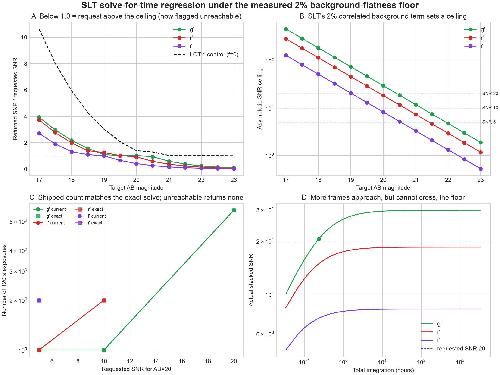
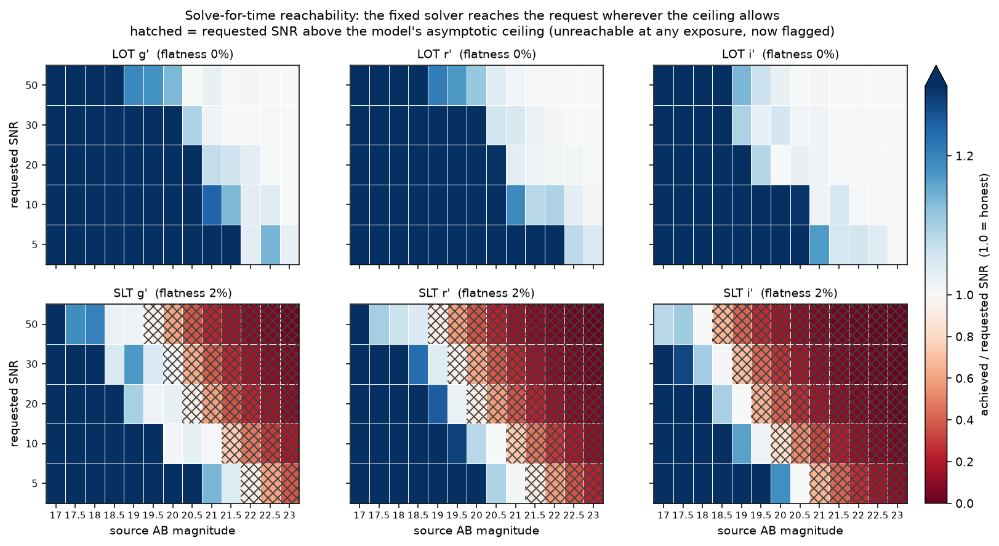

# CASTOR validation report

_Generated by `validation/build_report.py` from `validation/report_sections/`; do not edit this file directly._ Open questions live in [`QUESTIONS.md`](QUESTIONS.md).


---

## Overview

Comparisons between CASTOR and things outside CASTOR: other observatories'
calculators, published sky models, and — in time — real photometry from Lulin.

This is deliberately not `tests/`. A unit test asserts that the engine does what
we specified, runs on every commit, and is red when someone breaks it. What lives
here asserts what our answers are *worth*, and a failure is usually a finding
that needs a human to interpret. Mixing the two would make the fast suite slow
and the honest suite look broken.

```bash
pytest              # tests/ only — the specification suite
pytest validation   # this suite, on purpose
```

### What is here

The **Summary** section is the short path through the per-star SNR, colour-term,
inverse-solver, forward-performance and extended-source results; each of those
has its own section below, with its figure and a command to regenerate it. This
document is assembled from `report_sections/` by `build_report.py`; edit the
fragments there, not this file.

| | |
|---|---|
| `lco_etc.py` | Las Cumbres Observatory's published calculator, transcribed |
| `eso_etc.py` | ESO's FORS2 ETC — captured reference results, plus a live client |
| `lulin.py` | LOT/SOPHIA measured against real frames and Lulin's own documents |
| `slt.py` | SLT measured against the 2024-04-14 airmass sweep, and why its extinction is unusable |
| `endtoend.py` | LOT/SOPHIA r' SNR predicted by CASTOR against real frame-to-frame scatter |
| `lulin_prototype.py` | The two Perl calculators CASTOR was refactored from, 2005 and 2011 |
| `provenance.py` | Where every number in presets.json came from, or that it came from nowhere |
| `skycalc.py` | Loading and rebinning ESO SkyCalc radiance exports |
| `test_lco.py` | Count-rate chain and extinction conventions against LCO |
| `test_eso.py` | The top-hat bandpass against a full spectral integration |
| `test_sky_model.py` | How the Krisciunas & Schaefer moon term behaves per band |
| `test_lulin.py` | Throughput, sky and detector against 123 calibrated frames |
| `test_slt.py` | SLT's throughput against that night's fit, and that its extinction stayed out |
| `test_lulin_prototype.py` | Which of the ancestors' numbers survive, and which are placeholders |
| `test_provenance.py` | Fails on any preset value the provenance table does not account for |

### What the references are, and are not

**LCO** stopped being a physical model in 2023. Their calculator now looks up
photometric zero points measured from real images — their own source annotates
the collecting-area table "not used in code" and comments out the zero-point
fluxes. Comparing CASTOR against it checks a prediction against a calibration.
Where the two disagree, the interesting question is which *convention* differs,
not which number is right.

**The prototypes** are not an outside reference at all — they are CASTOR's own
ancestry. The project's slides record the chain as Kinoshita Daisuke's Perl CGI,
then Ting-Wan Chen, then this refactor, so where `presets.json` holds a number
nobody can source, `etc.cgi` (2005) and `etc2.cgi` (2011) are the likeliest
places it came from. Read them as archaeology, and read them warily: the 2011
file was never finished, and its Sloan tables are the Bessell tables relabelled.

**ESO** gives us two references. Their **ETC** (`etc.eso.org/fors`, and a REST
API behind it) is a real physical model over measured instrument curves, and is
the ground truth for the VLT/FORS2 preset — which came from it in the first
place: `dark_current_rate`, `readout_noise` and `full_well_capacity` appear
verbatim in both. Their **SkyCalc** radiance model is six emission components at
R=20000, and is the right reference for bandpass shape and for what the sky is
made of. Neither is the right reference for absolute agreement on a given night.

**Lulin** is the only reference here made of photons rather than models, and the
only one that can judge the profile the calculator opens on. Two separate
reductions, and the split between them is not administrative — they answer
different questions because they cover different things:

`lulin.py` is 123 calibrated LOT/SOPHIA frames over 18 nights against
Pan-STARRS DR2. Deep, but no single night in it spans more than 0.19 in
airmass, so it can measure throughput and sky and *cannot* measure extinction.

`slt.py` is 241 SLT frames from one night, 2024-04-14, sweeping airmass 1.81 to
3.72 in five bands — the observation `lulin.py`'s own open question asked for.
It gives SLT its first photometry ever, and it does **not** close extinction:
the sweep was real but the night was not photometric through it, and `slt.py`'s
`WHY_NO_EXTINCTION` shows how that was established from matched-airmass pairs
alone. Its reference catalogue is SkyMapper DR4 rather than Pan-STARRS, because
the field is at declination -32.8 and PS1 does not reach it; no colour-term
transform between the two systems has been applied, which is that reduction's
other large caveat.

Neither set of frames is in the repository — it is public — and both modules
carry the reduced result so the tests run without them. Their docstrings have
the methods.

### Data

`data/eso_skycalc_paranal_1nm.csv` is committed: 700 rows, 62 KB, the six
components binned to 1 nm. **The moon was up in this export** —
scattered moonlight is 80-93% of the total from u' through r' — so it is a
bright-sky dataset, not the dark-sky baseline `mu_dark` describes. `data/fors2_v_high_114.dat` is the measured FORS2
V_HIGH+114 transmission curve.

`data/raw/` is ignored. It holds the original 2.7 MB R=20000 SkyCalc export,
which is regenerable and would nearly double the size of a repository that
currently tracks no binary data at all — the same call already made for
`de421.bsp`. Regenerate the binned file from it with:

```bash
python validation/skycalc.py
```

Binning rather than thinning is not a detail. The sky spectrum is full of narrow
airglow lines, and taking every n-th sample moves a broadband integral by 3-5%
in a direction that does not settle as the grid coarsens. `test_eso.py` asserts
both halves of that: the binned grid conserves the integral, and subsampling
would not.

### Standing findings

Each of these is asserted by a test, so it either stays true or announces itself.

- **The two count-rate chains are the same algebra.** Calibrate CASTOR's optical
  train to an LCO zero point and the sky rate matches to nine digits, in every
  band. Every other difference below is convention or input, never formula.
- **LCO applies no extinction to the sky; ESO's sky grows with airmass; ours is
  now flat.** Flat matches LCO exactly and stops the double-counting that used
  to make it *fall*. ESO is 17.6% brighter at X=1.5 and 31.8% at X=2.0, so the
  growth is still unmodelled and stays as an xfail.
- **LCO's magnitudes are referred to the zenith,** ours to above the atmosphere.
  The two conventions differ by a constant, so relative to the zenith all three
  calculators agree on airmass dependence to 0.02%.
- **CASTOR's aperture and ESO's are two points on one trade-off curve.** Give
  CASTOR ESO's aperture and the two agree to under a percent, so nothing here is
  formula. Hold image quality equal and the convention alone is worth 2.5% at the
  shipped `aperture_factor` of 0.85, where CASTOR's aperture is *narrower* than
  ESO's 1.03 FWHM, not wider. Which is better depends on the target: ESO's 1.03 is
  all but optimal on their dark-sky case and 0.85 gives up 2.5%, while under a full
  moon the optimum falls to 0.70 FWHM and 0.85 beats 1.03 by 9%. 0.85 is the point
  that stays within 3% of the best available at both ends; the superseded 1.5 gives
  up a third of a moonlit measurement. The old 11% figure quoted here measured this
  *and* the image-quality difference together — matched on image quality, the PSF is
  worth 4.2% by itself, more than the aperture is.
- **The 0.85 default is photon-optimal, not automatically extraction-stable.**
  Repeating the LOT/SOPHIA end-to-end measurement with the same stars and frames
  gives 1.3-3.3% scatter for bright stars at 0.85 FWHM, but only 0.4-0.9% at
  1.5 FWHM and 0.6-1.0% with a free-width PSF fit. Intrinsic variability would
  remain in all three measurements; the excess isolated to the tight aperture is
  therefore extraction sensitivity to local PSF changes. CASTOR keeps 0.85 as its
  photon-limit default, while an aperture pipeline without PSF stability or an
  aperture correction should supply the larger aperture it actually uses.
- **The VLT/FORS2 preset's throughput is a fudge that works in one band.**
  `v_HIGH+114` is right to 8% only because a 0.51 'transmission' absorbs an
  optical throughput twice too optimistic; `g_HIGH+115` over-predicts by 148%.
- **Lulin's four Sloan filters were placeholders.** All carried transmission 0.9
  and three shared a bandwidth of 137 nm. Against the Astrodon curves Lulin
  publishes, g' was out by 16%, r' and i' by 5%, and z' by 55% — a 278 nm filter
  described as a 137 nm one. Now corrected from the measured curves. LOT u' has
  no published curve and keeps its placeholder.
- **LOT's throughput was 2.6x too high, and band-dependent.** Pan-STARRS
  photometry over 14 photometric nights puts T_sys at 0.265 (g'), 0.480 (r'),
  0.265 (i'), where the preset asserted 0.68 in all three. Both this and the sky
  below now live on the filter entry, which is the only place in the file that
  varies with band — see the note on band fragments in presets.json.
- **Lulin's sky is not one number either.** Moonless, it measures 21.44 (g'),
  20.92 (r'), 20.04 (i') AB mag/arcsec2, against a single site-wide 21.5 that
  suited g' and was 1.46 mag out in i'. Bands with no measurement, u' among
  them, still inherit the site value.
- **The frame headers' own zero point cannot be used.** PinPoint's `ZMAG` is
  tied to USNO-B1.0 and sits 0.73 mag out in g', 0.21 in r' and 0.05 in i'.
- **The moon model has no colour.** Krisciunas & Schaefer is Johnson V, and the
  only band-dependence CASTOR gives it is the extinction coefficient. Moonlight
  comes out far too blue and nearly vanishes in the near-infrared, where a full
  moon is under-counted by about a factor of ten.

- **The ancestors had the same disease, and one of them documented the cure.**
  The 2011 prototype decomposes throughput exactly as the ATBD specifies, into
  optics x filter x quantum efficiency — so the VLT preset hiding an optimistic
  throughput inside a filter transmission violates a form the project has had
  since 2011. It also fabricated its Sloan tables by relabelling the Bessell
  ones, twenty-four numbers with no exceptions, which is why nothing Sloan from
  that file may be adopted as a source. The 2026 slides had already named the
  pattern in the original prototype: *"Hidden Errors (Two Wrongs Make a Right)"*.

- **Lulin publishes more than anyone had looked for.** Trebur's 2001 offer
  document gives LOT's mirrors outright, SOPHIA's datasheet is on the same page,
  and the filter inventory carries transmission curves for SLT's Astrodon 2018
  ugriz and UBVRI sets as well as LOT's 2019 griz. Between them they closed the
  secondary mirror, corrected a full well that was 50% low, and replaced the u'
  placeholder with a measured curve. Every one of those had been sitting behind
  a link on the observatory's own site.

- **presets.json was invented, and now says which parts still are.** Nothing in
  it had a source when it was written, and every value a check reached turned
  out wrong — so the prior for anything unaccounted for is that it was made up
  too. `provenance.py` records an origin for all 118 values and a test fails if
  the file holds one the table does not, or a different number than the one
  recorded. Lulin is now 57 sourced against 6 guesses; VLT — not the default,
  and not what anyone here observes with — is 8 against 12, up from 3 once its
  site stopped being left unset. `other` (a personal amateur rig, nominally at
  Hehuan Mountain's Yuanfeng dark-sky viewpoint) is new and starts at 28 sourced
  against 7 — every telescope's collecting geometry and every camera's read
  noise and full well are real, only the optical throughputs and one borrowed
  dark current are placeholders. See `provenance.summary()`.

- **SLT went from a completely unmeasured guess to real photometry — and the
  same night failed to measure extinction, for a reason worth keeping.** SLT,
  2024-04-14, SN2024ggi: 241 frames sweeping airmass 1.81-3.72, the first
  LOT/SLT data ever to have a real single-night sweep. It closed QUESTIONS.md 5,
  giving SLT per-band throughput of 0.10-0.47 and replacing a guessed 0.804 that
  had no reason to beat LOT's own measured 0.27-0.48 and didn't. It did **not**
  close question 4: matched-airmass pairs show the sky faded 0.1-0.4 mag between
  the halves of the night, and since the target was setting, that fade is
  degenerate with the airmass term and inflates every k. The band that faded
  most is the band inflated most, which is what identifies it as weather. The
  *ordering* survives — extinction falls towards the red on every cut — and no
  absolute value does, so presets.json keeps the site-wide 0.17 and `test_slt.py`
  asserts the per-band values stay out. Calibrated against SkyMapper DR4, not
  Pan-STARRS DR2 — this field's declination (-32.8°) is outside PS1's
  footprint — so it carries an uncorrected systematic on top of the fit error
  from the two systems' natural photometric bands not being identical.
  Discovered along the way: presets.json's per-filter telescope override had
  no telescope of its own — selecting SLT with a filter LOT had measured
  silently applied LOT's number. Fixed by keying the override by telescope id;
  see `castorCLI/presets.py`'s `FilterEntry.telescope`.

- **SLT has had three cameras, and one of its own header fields lies about
  which.** The observatory's raw nightly archive (not `2024ggi`'s pre-reduced
  set) spans Andor DZ936 (2021), Apogee Alta U9000 (2022 on), then the current
  DU934P-BEX2-DD. Some 2022 headers name the camera "U42" — a real, different
  Apogee model, 2048x2048 at 13.5um — but the frames themselves are 3056x3056
  at 12um, U9000's geometry exactly. The name is stale, not the hardware; only
  the pixel geometry, read straight from the detector, can be trusted. Both
  retired cameras are now in `presets.json` (`SLT_DZ936`, `SLT_U9000`) so
  frames from those eras can still be reduced, sourced from Andor's own iKon
  brochure and a U9000 datasheet Lulin hosts itself.

- **SOPHIA's dark current at -80°C is now bounded by a real dark frame, not
  guessed.** 20 real -80°C, 300s frames (QUESTIONS.md 6) — no bias frame to
  subtract, so measured through the frame-to-frame variance instead of the
  mean level. The variance came in *below* read-noise-squared: dark current is
  too small for this method to detect, an upper limit rather than a
  measurement. The guessed 0.01 e-/s/pix is replaced with 0.001, the
  datasheet's -90°C figure scaled to -80°C by the same halving-interval method
  used for the ASI2600MC — consistent with, not contradicted by, the
  non-detection.

- **`mu_dark` stopped meaning "the whole sky" for Lulin's g'/r'/i'.** Zodiacal
  light and scattered starlight — 27%, 27% and 14% of what those three bands'
  photometry actually measured — have been split back out, leaving `mu_dark` as
  airglow and light pollution only and letting the engine add the zodiacal part
  back in sized to wherever the target actually points, rather than baking in
  the one sightline the frames happened to look down. `zodiacal_share` records
  what was split out; `castor.moon.ZODIACAL_LATITUDE_SHAPE` derives the pointing
  dependence from ESO SkyCalc, and independently reproduces the plane-to-pole
  swing `skycalc.AT_LULIN` already published (0.174 / 0.193 / 0.101 mag) to the
  third decimal. Every other profile is unaffected — this needs a measurement
  nobody else has. See `QUESTIONS.md` 9 and 10.

### Open questions

**[QUESTIONS.md](QUESTIONS.md)** is the single index: seventeen items, two of
them already marked CLOSED, each labelled with who can close it — the
observatory, a night of telescope time, us, or a decision. Nothing open is
recorded only here, in a `GUESS` row, or in an xfail reason; if it is open, it
is in that file.

Four items have been closed by looking harder rather than by asking. Lulin
publishes Trebur's 2001 offer document, which gives LOT's mirrors outright — a
360 mm secondary, not the 300 the preset guessed, and not the 130 the frame
headers seemed to imply, which turns out to be the hole through the primary
rather than any obstruction at all. Lulin's SLT
page names the camera in full — Andor iKon-M DU934P-BEX2-DD CCD-26868 — which
fixes the sensor variant and with it the 130 ke- well depth. A photon transfer
curve over the frames puts read noise at 7.9 e-, confirming the header gain to 2%
and identifying the 1 MHz port. And the question of whether the telescope's
optics could explain the r' excess is answered in the negative by the 2011
prototype's own decomposition, which leaves them flat to 2.3% across g' to i'.

---

## Summary

Five analyses now connect the real Lulin frames to decisions an observer can
make with CASTOR. Each result has a publishable table, a regenerating script,
and a validation test; the observatory's FITS files remain ignored.

| Analysis | Main result | Section |
|---|---|---|
| LOT r' per-star SNR | 261 stars below 60 ke- give median observed/predicted SNR **1.011**, bootstrap 95% CI 0.980–1.050; no resolved flux, colour, or detector-radius trend | End-to-end residuals |
| LOT r' colour term | `+0.0182 mag per mag` in Pan-STARRS g-r (95% CI +0.0036 to +0.0423); only 1.5% across the central 90% colour range, far too small to explain the r' throughput excess | Colour term |
| Correlated-noise inverse audit | Fixed: solve-for-time now inverts the full stacked-SNR relation and reports SLT r' AB=20 SNR 20 as **unreachable** (ceiling **18.46**) instead of the old six-frame / SNR 14.44 answer | Solve-for-time flatness |
| Forward performance | Under the stated standard scene, one-hour SNR=5 limits are LOT g/r/i = **23.91/23.84/23.04**, SLT = **21.84/21.36/20.51** AB mag | Forward performance |
| Extended-source noise | NGC 3621 SLT r': the fixed model (RN 9.28 e- + 2% flatness) tracks measured aperture noise to **~1%** to 12"; the shipped RN-3.3 model ran 1.5–3.2x low | Extended-source noise |

Four further figures draw data the tables only summarise: the
observed-vs-predicted noise 1:1 scatter and the ADC-ceiling saturation plot
(`figures/lot_r_noise_scatter.png`), the per-term noise budget with depth-vs-
time and the validated anchor (`figures/lulin_noise_budget.png`), the
solve-for-time reachability map (`figures/solve_time_reachability.png`), and
the extended-source noise-vs-radius comparison
(`figures/extended_noise_vs_radius.png`).

### What is established

The current forward noise equation reproduces the LOT r' frame-to-frame
scatter at the population level after the real ADC saturation selection is
applied. Within the statistical power of fifteen frames, its residual does not
depend monotonically on source flux, stellar colour, CCD x/y, or distance from
the detector centre.

LOT r' does have a small natural-system colour coefficient against Pan-STARRS,
but the reference-colour zero point agrees with the existing multi-night
calibration within 0.0033 mag. The present throughput therefore need not move
on this evidence. Future calibration should nevertheless reject extended
sources and fit colour explicitly.

### What was broken, now fixed

The forward and inverse calculations used to disagree whenever
`background_flatness_fraction` is nonzero: forward stacking retained the
correlated term while `solve_required_exposures()` assumed every term averaged
down as sqrt(N). Question 17 is now closed — the inverse solves the full
`SNR(N) = N*S / sqrt(N*V + N^2*F^2)`, takes the ceiling `S/F` from
`calculate_flatness_snr_ceiling()`, and returns an explicit unreachable result
(`target_reachable = false`) that the response schema, CLI, GUI and batch path
all surface. `test_solve_time_floor.py` is a passing regression.

### What the capability comparison does not prove

SLT carries a measured 2% correlated background residual. Sophia currently
carries zero, meaning unmeasured rather than absent, so the long-integration
LOT/SLT gap is partly a model-completeness gap. The atlas is also conditional
on one pointing, 1.4 arcsec seeing, 120 s frames, the top-hat passbands and the
site-wide extinction fallback. It is a planning baseline, not an empirical
limiting-magnitude claim.

### Recommended order from here

1. Measure Sophia's background-flatness floor with the same empty-aperture
   method used for SLT before treating long-stack LOT/SLT curves as symmetric.
2. Repeat the colour-term fit in g' and i' and on independent fields.
3. Repeat the end-to-end SNR check at another sky level, band and airmass.
4. Add uncertainty propagation only after the two instruments' missing floors
   and colour terms are represented; otherwise the interval would formalise
   known omissions as if they were zero.

---

## LOT r' per-star end-to-end residual analysis

This is the star-level version of the binned result in `endtoend.py`. It uses
the same fifteen 120 s LOT/SOPHIA r' frames from 2025-11-06 and applies the
final saturation selection: every retained star remains below 50,000 e- peak
in every frame, clear of the 60,292 e- 16-bit ADC ceiling.


### Result

| Selection | Stars | Median observed/predicted | IQR | Bootstrap 95% CI of median |
|---|---:|---:|---:|---:|
| All saturation-safe stars | 299 | 0.995 | 0.888–1.151 | 0.976–1.039 |
| ETC regime, flux < 60 ke- | 261 | **1.011** | 0.902–1.168 | 0.980–1.050 |

The current CASTOR noise model is unbiased at the population level on this
night: the ETC-regime median is +1.1% from perfect
agreement. The broad per-star scatter is expected in part because every
observed noise is itself estimated from only 15 frames (`sigma_relerr = 18.9%`).

### Residual checks in the ETC regime

The table reports Spearman rank correlations. Confidence intervals bootstrap
stars 5,000 times; an interval crossing zero means this night does not resolve
a monotonic trend.

| Residual against | Stars | Spearman rho | Bootstrap 95% CI |
|---|---:|---:|---:|
| log10 source flux | 261 | +0.036 | -0.084 to +0.157 |
| Pan-STARRS g-r colour | 257 | -0.036 | -0.162 to +0.090 |
| CCD x | 261 | -0.084 | -0.208 to +0.038 |
| CCD y | 261 | -0.082 | -0.203 to +0.040 |
| distance from CCD centre | 261 | -0.079 | -0.199 to +0.041 |

No tested variable has a resolved monotonic relationship with the residual.
In particular, the colour result uses 257 catalogue-quality
stars and gives no evidence that source colour changes the *noise-model*
accuracy in r'. This does not replace a photometric colour-term fit, which is a
separate test of the count-rate calibration.

The 4x4 detector map uses the same below-60-ke- selection and has noisy cells
(some contain only a handful of stars),
but no coherent centre-to-edge trend; the global radial correlation above is
the appropriate summary. The mild downturn in the full brightness range comes
from the last three bins and is absent below 60 ke-, so it should not be turned
into another fitted noise term from this one night.

### Scope

This establishes one condition only: LOT, SOPHIA, r', one field, one night,
airmass 1.035–1.044, a 3xFWHM aperture, and a 5–8xFWHM median sky annulus. It
does not validate another band, telescope, extraction method, airmass, or sky
level. The publishable star table is `data/lot_r_endtoend_per_star.csv`; its
catalogue colours and detector positions make these checks reproducible without
publishing the raw observatory frames.

Regenerate from the ignored reduction products with:

```bash
uv run --with pandas --with matplotlib python validation/analyze_endtoend_residuals.py
```

---

## Per-star noise scatter and the ADC ceiling

Two per-star views the binned end-to-end table cannot show, both read from the
committed `data/lot_r_endtoend_per_star.csv` and
`data/lot_r_endtoend_peak_vs_flux.csv`.


The left panel is the model-free validation: predicted against observed noise
for every star, with the 1:1 line. The faint majority pile up at the sky-plus-
read floor near 600 e-, scattering symmetrically about the line, and the
ETC-regime median lands at obs/pred 1.011. The right panel is the bright-end
story in one plot: each star's brightest pixel against its aperture flux,
flattening hard at the 60,292 e- 16-bit ADC ceiling. Six stars are pinned there
and another handful clear the 50,000 e- peak cut, which is why the headline
sample is restricted to saturation-safe stars rather than carrying a spurious
noise floor.

Regenerate with:

```bash
uv run --with pandas --with matplotlib python validation/analyze_noise_scatter.py
```

---

## LOT r' photometric colour-term audit

The end-to-end field also tests whether calibrating LOT's natural Astrodon r'
response directly against Pan-STARRS r introduces a stellar-colour bias. This
is a count-rate calibration test, separate from the SNR residual test in the
per-star end-to-end section.


### Selection

The fit starts from the 299 saturation-safe stars, requires measured SNR >=
20, valid Pan-STARRS g/r/i colours, and uses
`-0.20 < r_PSF - r_Kron < 0.05` to select point sources. That last cut matters:
extended objects measured with a circular aperture form a separate zero-point
branch up to 1.4 mag high. Of 101 point-source candidates,
97 survive a three-MAD residual clip.

### Result

At the sample's median colour, `g-r = 0.571`, the observed
zero point is:

`ZP_r = 23.7855 + (+0.0182) * ((g-r) - 0.571)`

| Quantity | Estimate | Bootstrap 95% CI |
|---|---:|---:|
| Zero point at reference colour | 23.7855 mag | 23.7822 to 23.7896 |
| Colour coefficient | **+0.0182 mag per mag** | +0.0036 to +0.0423 |
| Residual scatter | 0.0174 mag | — |

The coefficient is small but resolved in this sample. One magnitude of g-r
changes the inferred count rate by +1.69%. Across the accepted
sample's central 90% colour range (0.30 to 1.20),
the full effect is 0.016 mag, or
1.51% in count rate.

The multi-night calibration in `lulin.py` predicts ZP =
23.7888 at this sample's median airmass
(1.038); this fit differs by -0.0033 mag. That is
an internal consistency check, not independent evidence, because both use the
same LOT field.

### Consequence

This is too small to explain LOT's factor-1.8 r' throughput excess over g' and
i'. It does show that future throughput fits should include a colour term and a
point-source morphology cut. The present r' throughput need not move: its
reference-colour zero point agrees with the existing multi-night relation to
well below one percent. A multi-band fit over independent fields is still
needed before adopting coefficients in the calculator itself.

Regenerate with:

```bash
uv run --with pandas --with matplotlib python validation/analyze_lot_color_term.py
```

---

## Solve-for-time versus the correlated background floor

The SLT DU934P preset carries the 2% background-flatness residual measured from
real extended-source data. That term is correlated across a stack, so it does
not average down: it fixes an asymptotic SNR ceiling `S/F` no exposure count can
cross. CASTOR includes it both when it computes a stack's SNR **and**, since the
question-17 fix, when it solves for the number of exposures. The old
`N = (target_snr / single_snr)^2` — valid only when every variance term is
independent between frames — has been replaced by the full inverse below, and an
unreachable request is now reported as such instead of answered with a count
that never meets it.



### Concrete result

Standard case: SLT/DU934P, AB=20 point source, 120 s frames, 1.4 arcsec seeing,
0.85xFWHM aperture, 3–5xFWHM median annulus, the Lulin preset's own sky, target
near zenith, and requested SNR 20.

| Band | Asymptotic SNR ceiling | Exposures CASTOR now returns | Outcome |
|---|---:|---:|---|
| g' | 29.78 | 7 | reaches SNR 20 |
| r' | 18.46 | unreachable | ceiling 18.46 < 20, reported unreachable |
| i' | 8.27 | unreachable | ceiling 8.27 < 20, reported unreachable |

The r' request sits above its own ceiling: the response now returns
`target_reachable = false`, `required_exposures = null`, `total_snr` = 18.46 (the
ceiling), and a warning, rather than the six frames / SNR 14.44 the square-root
law used to claim. The i' target is farther beyond its ceiling. The g' target is
reachable and now takes 7 frames — enough to actually clear SNR 20 — where the
old solver returned 4 and reached only 17.35.

LOT is the control: Sophia's preset has `background_flatness_fraction = 0`, so
the ceiling is infinite, the inverse collapses to the exact square-root law, and
its achieved/requested curve never falls below one. Bright cases can overshoot
because one indivisible frame already exceeds the requested SNR.

### The inverse that is now solved

For one frame, let `S` be source electrons, `V` the sum of every independent
variance term, and `F` the correlated flatness-noise amplitude. A stack of N
frames has

`SNR(N) = N*S / sqrt(N*V + N^2*F^2)`

and therefore the ceiling `S/F`. For a requested SNR `Q`:

`N = Q^2*V / (S^2 - Q^2*F^2)`

If the denominator is zero or negative (`Q >= S/F`), no finite exposure count can
reach the request under the model, and CASTOR reports the target as unreachable.
The analysis sweep evaluates this expression against the shipped
`required_exposures` over LOT/SLT, g'/r'/i', AB 17–23 and target SNR 5–50; the two
agree wherever the target is reachable, and the shipped solver returns the
unreachable flag everywhere the ceiling is below the request.

### Status

Closed (validation question 17). The inverse solver, the response schema
(`snr_ceiling`, `target_reachable`), the CLI, the GUI and the batch path all
express the ceiling and the unreachable case; `test_solve_time_floor.py` is a
passing regression. This audit is retained as a check that the shipped solver
keeps matching the exact stack equation.

Regenerate with:

```bash
uv run --with pandas --with matplotlib python validation/analyze_solve_time_floor.py
```

---

## Solve-for-time reachability map

The single operating point in the section above is one cell of a larger grid.
Sweeping LOT/SLT x g'/r'/i' x AB 17-23 x requested SNR 5-50 shows the whole
reachable/unreachable structure the fixed solver now respects.



Colour is achieved-over-requested SNR for the returned exposure count, so 1.0 is
honest and blue is a harmless integer-frame overshoot. Before the question-17
fix the SLT row turned red across a wide band of faint targets and high SNR
goals — requests the old sqrt(N) solver accepted but undershot, worst of all SLT
i' at AB 23, SNR 50, where it delivered 1% of the request. The corrected solver
returns a count that meets the request wherever the target is below the ceiling,
so those cells now sit at 1.0 or a small integer-frame overshoot. The hatched
cells are requests above the model's asymptotic ceiling: unreachable at any
exposure, and now reported as `target_reachable = false` with no frame count
rather than silently undershot. The LOT row (flatness 0) has an infinite ceiling,
so the exact square-root law applies and it is honest everywhere.

Regenerate with:

```bash
uv run --with pandas --with matplotlib python validation/analyze_solve_reachability.py
```

---

## Lulin forward-performance atlas

This compares LOT/Sophia and SLT/DU934P by evaluating CASTOR's forward noise
equation over actual integer stacks. It deliberately does not call the inverse
exposure solver audited in the solve-for-time section.


### Standard scene

Point source, AB magnitudes, g'/r'/i', 120 s sub-exposures, 1.4 arcsec seeing,
0.85xFWHM aperture, 3–5xFWHM median sky annulus, fixed target near zenith at
Lulin, no lunar term, and each filter's current preset sky and throughput.

| Telescope | Band | SNR=5, 120 s | SNR=5, 1 h | SNR=5, 4 h | SNR=10, 1 h |
|---|---|---:|---:|---:|---:|
| LOT | g' | 22.03 | 23.91 | 24.66 | 23.15 |
| LOT | r' | 21.98 | 23.84 | 24.60 | 23.09 |
| LOT | i' | 21.17 | 23.04 | 23.79 | 22.28 |
| SLT | g' | 20.82 | 21.84 | 21.91 | 21.08 |
| SLT | r' | 20.60 | 21.36 | 21.40 | 20.61 |
| SLT | i' | 19.97 | 20.51 | 20.54 | 19.76 |

The one-hour curves show the expected aperture advantage of LOT. They also
show the consequence of model completeness: SLT carries a measured 2%
background-flatness floor and gains progressively less depth with long stacks,
while Sophia currently carries zero because no equivalent floor has been
measured for it. Zero means "not modelled", not evidence that LOT has no
correlated background residual.

At AB=20, sky photons dominate most 120 s configurations. Read noise matters
more for SLT because there are fewer source electrons, while the correlated
term is already visible in its one-frame variance and controls its long-stack
limit. Dark current is negligible in these particular 120 s cases.

### Limits on interpretation

These are conditional model predictions, not measured limiting magnitudes or
uncertainty intervals. They use the current top-hat filters, one pointing, one
seeing value and the site-wide 0.17 extinction fallback. Readout overhead is
not modelled. Saturation uses the preset physical full well; LOT frames in the
end-to-end night actually hit their 16-bit ADC ceiling near 60,292 e-, so the
bright boundary in the CSV is optimistic for that operating mode.

Regenerate with:

```bash
uv run --with pandas --with matplotlib python validation/analyze_lulin_performance.py
```

---

## Noise budget and depth versus time

The forward atlas above, read for what limits each rig rather than for headline
numbers.


The top panels split the one-hour variance by term against source magnitude.
LOT r' walks from source-limited at the bright end through a sky-dominated
middle to a read-noise floor; SLT r' is swamped by the correlated 2% flatness
term at everything fainter than roughly AB 17, which is exactly why its long
stacks stop getting deeper. The bottom panel is the consequence: SNR=5 limiting
magnitude against total exposure time, where LOT keeps descending as sqrt(t)
while the SLT curves bend flat. The star marks the 1,800 s LOT r' point where
the underlying noise model was validated end-to-end at obs/pred 1.011 (the
per-star end-to-end section), so this one abscissa is anchored to data and the
rest is model extrapolation.

Regenerate with:

```bash
uv run --with pandas --with matplotlib python validation/analyze_noise_budget.py
```

---

## Extended-source noise: model against a real galaxy

The extended-source noise model was checked against NGC 3621 in SLT r'
(42 x 30 s, 2024-04-12, Siril mean-stack). The measured noise carries no model
at all: the clear frames are split alternately into two half-stacks and
differenced, so nothing astrophysical survives and the aperture scatter of the
difference is noise and noise only. This is the committed, publishable summary
of the fuller reduction whose raw frames stay out of the repository.


### What the picture shows

The left panel is aperture noise against aperture radius, scaled to a single
30 s frame, for six radii from 1.5" to 12.2". The measured curve (black) is
compared with what CASTOR predicted at the time of the test and what it
predicts after the fix on branch `fix/slt-noise-model`:

* **Shipped model (red), Andor read noise 3.3 e-, no correlated term.** It
  grows only as sqrt(area) and falls progressively below the measurement, from
  1.5x low at 1.5" to 3.2x low at 12.2".
* **Fixed model (blue), read noise 9.28 e- plus a 2% background-flatness
  floor.** It tracks the measurement to about 1% once the flatness term
  dominates past ~4", and stays within 6-10% at the smallest apertures where
  the read-noise correction alone carries the change.

The right panel is the same story as a ratio: the shipped prediction runs away
from unity with radius, the fixed prediction sits on it.

### Two independent fixes are folded into the blue curve

**Read noise.** The delivered calibrated frames carry ~9.3 e-/px of non-Poisson
noise, measured twice independently, not the 3.3 e- the preset held for the
DU934P. That is the noise a user of these pipeline products actually gets.

**Background flatness.** All six radii fit `sigma^2 = N_pix*(sky + RN^2) +
(f*N_pix)^2` with `f = 0.741 e-`, 2.0% of the background. It enters as area,
not sqrt(area) -- flat-field and background-gradient residuals rather than
photons -- so past ~4" it, not read noise, is what the gap was made of. The
floor measured on this cloudy night is an upper limit on a good night.

### Scope

One telescope, one band, one galaxy, one night. The rate formula itself is
correct to 1 part in 10^4; this tests only the noise and the aperture geometry.
Two known design limitations are recorded separately and not visible here: the
aperture is tied to the PSF rather than specifiable in arcsec, and
`saturation_time_limit` assumes a flat profile.

Regenerate the figure from the committed per-radius aggregate with:

```bash
uv run --with pandas --with matplotlib python validation/analyze_extended_noise.py
```
